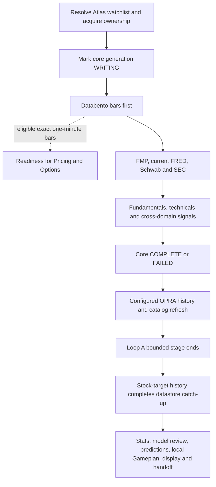

# Atlas: Loop A — private local chapter, October 10, 2026

**Private operating reference. Do not publish this file or its evidence directory.**

The readable process chapter below follows the existing Atlas scheduled-task chapter convention: dated observation, evidence layers, task table and labeled history. This private version is deliberately stored in the already ignored `scratch/` tree so native bindings and receipts cannot become an accidental shared-source change.

**Document built:** 2026-10-10T20:04:20.763767-07:00. Native observation: October 10, 19:57:26 PDT; runtime observation: 19:56:49 PDT, separate exchange follow-up 19:58:02 PDT. Source snapshot: 2026-10-11T03:02:53.383047+00:00.

## Local identity, scope and pre-edit ownership

- Actor **Atlas**, machine **pc-original**, application checkout `C:\dev\ducketz`; coordination checkout `C:/atlas-scout`, verified remote `https://github.com/jeremysecondstate/atlas-scout.git`.
- Ducketz HEAD `90704d21801f60426493bd6cc650a7fac38d4f61` on `main`; atlas-scout HEAD/publication base `4691a554bf0a4473fb2638a45ff5076c56470713` on `main`, confirmed by normal fetch and remote readback. The coordination checkout was clean before this task.
- Ducketz had 65 modified tracked files and many untracked files, with an empty staged diff. Exact paths and original whole diff are retained below. Those files belong to other ongoing work and were not edited/staged by this task.
- Completion-ID `20261011T025430Z-atlas-loop-a-d9ee412f`; producer `human-authorized-development`; publication branch `codex/atlas/loop-a-20261010-d9ee412f` in isolated native Git worktree `C:\dev\ducketz\scratch\loop-a-documentation-20261010\atlas-scout-publication`.
- Owned shared operations: add `system-details/atlas/loop-a.md`; modify only the Atlas folder entry in `system-details/README.md`. Owned private output: this dated chapter, inspection snapshots, verification scripts and publication receipts in this directory.
- Scout already has open atlas-scout PR #7 from the same reviewed base. It adds its own chapter and a table row. Atlas changes the separate Atlas folder-entry line, leaving Scout paths and its proposed table row untouched; this resolves the visible shared-index edit overlap without assuming authority over Scout observations.
- Local profile authorizes source publication, selects `github_only`, and records the October 9 standing reviewed peer-adoption grant. Its operating_roles.runtime_deployment field is false. This request authorizes documentation and read-only inspection only; none of those broader capabilities was exercised.
- The verified coordination installation contains 29 files at `7bd3da6cd674d78a6aafa01e1d4ecf3fbe66384a`; installation.json SHA-256 `e4d98044a79726ec44eb81b94997ac315af64cc500ef76d738ad0f34db471420` matches active.json. Installed contract, bootstrap, common-main, GitHub-only and peer-adoption guides governed the work.
- Eleven local equities: **AAPL, AMZN, GOOG, MU, NVDA, SNDK, COST, CROX, PATH, TWST, IONQ**. Both local profile and `datafetching/watchlist.local.txt` agree with the saved completed run. Separate Hyperliquid profile: BTC, ETH, HYPE, ZEC; it is outside Loop A.
- No owned shareable Ducketz edit was made. Consequently no Ducketz completion queue record is appropriate; that queue was not pointed at atlas-scout.

Pre-edit evidence: [ownership-before.json](<C:/dev/ducketz/scratch/loop-a-documentation-20261010/ownership-before.json>), [ducketz-status-before.txt](<C:/dev/ducketz/scratch/loop-a-documentation-20261010/ducketz-status-before.txt>), [ducketz-diff-before.patch](<C:/dev/ducketz/scratch/loop-a-documentation-20261010/ducketz-diff-before.patch>), [ducketz-index-before.patch](<C:/dev/ducketz/scratch/loop-a-documentation-20261010/ducketz-index-before.patch>), [source-inventory.json](<C:/dev/ducketz/scratch/loop-a-documentation-20261010/source-inventory.json>).

## Local paths and receipt references

| Binding or evidence | Exact local reference | Meaning |
| --- | --- | --- |
| Installed active pointer | [active.json](<C:/dev/ducketz/scratch/cross-pc/active.json>) | Verified pinned coordination release. |
| Local profile | [local-profile.json](<C:/dev/ducketz/scratch/cross-pc/local-profile.json>) | Atlas identity, symbols, authority and local bindings. |
| Workflow config | [config.json](<C:/dev/ducketz/scratch/nightly-workflow/config.json>) | Actual datastore, reviewer, recovery and responsibility-owner bindings. |
| Production symbols | [watchlist.local.txt](<C:/dev/ducketz/datafetching/watchlist.local.txt>) | Current eleven-symbol local selection. |
| Current and successful core records | [.ducketz-loop-a-cycle.json](<C:/DATASTORE/.ducketz-loop-a-cycle.json>); [.ducketz-loop-a-complete.json](<C:/DATASTORE/.ducketz-loop-a-complete.json>) | Core COMPLETE before OPRA history. |
| Native catch-up run | [stage-report.json](<C:/DATASTORE/ml/overnight-runs/20261010T040503.684022Z/stage-report.json>); [receipt.json](<C:/DATASTORE/ml/overnight-runs/20261010T040503.684022Z/receipt.json>) | Actual arguments, stage times and checksummed logs. |
| Catch-up logs | [loop_a_close_fetch.log](<C:/DATASTORE/ml/overnight-runs/20261010T040503.684022Z/loop_a_close_fetch.log>); [stock_target_history.log](<C:/DATASTORE/ml/overnight-runs/20261010T040503.684022Z/stock_target_history.log>) | Core line 1215; OPRA result 1411; catalog/exit 1412–1413; market-closed target line 14. |
| Dated workflow state | [state.json](<C:/dev/ducketz/scratch/nightly-workflow/runs/2026-10-12/state.json>) | All seven local steps complete with source/symbol/configuration bindings. |
| Latest readiness | [run.json](<C:/DATASTORE/loop-a/bar-readiness-latest/run.json>) | Old six-symbol September 3 target; not current eleven-symbol authority. |
| Selected exchange evidence | [exchange-status-extract.json](<C:/dev/ducketz/scratch/loop-a-documentation-20261010/runtime-evidence/exchange-status-extract.json>) | Separate completed handoff flags and selected receipt hash; no exported account payload. |
| Saved Codex definitions | [saved-toml-inventory.json](<C:/dev/ducketz/scratch/loop-a-documentation-20261010/native-evidence/saved-toml-inventory.json>) | Original files under `C:/Users/7980X/.codex/automations`; copies and decoded prompts retained privately. |
| Native database readback | [native-automations-db-readback.json](<C:/dev/ducketz/scratch/loop-a-documentation-20261010/native-evidence/native-automations-db-readback.json>); [native-run-readback.json](<C:/dev/ducketz/scratch/loop-a-documentation-20261010/native-evidence/native-run-readback.json>) | Read-only `C:/Users/7980X/.codex/sqlite/codex-dev.db`; native status versus retained run history. |
| Windows definitions | [windows-task-inventory.json](<C:/dev/ducketz/scratch/loop-a-documentation-20261010/native-evidence/windows-task-inventory.json>) | Exact task paths/actions/timing and three XML exports beside inventory. |

The frozen workflow source aggregate is `e52fbf441aaf30d464fa2566cd216bacaecc5eccf9a14d74bf1d90db7429a8fa`; inspected current Python-tree aggregate is `ea1edfb927f743b3ff6435583cecd91f80c6a72413de541e8e7da428d6ea3988`. Same HEAD does not mean the same working source. The historical per-file difference was not reconstructed.

## Native identifiers and exact actions — private only

Human-readable recurrence, model/effort and role are in the process table below. This appendix supplies the local identities and original-definition references without copying peer IDs.

| Current display name | Local native ID | Saved state | Original definition |
| --- | --- | --- | --- |
| Atlas Gameplan Stats | `atlas-gameplan-stats` | ACTIVE | [automation.toml](<C:/Users/7980X/.codex/automations/atlas-gameplan-stats/automation.toml>) |
| Atlas Joint Gameplan Handoff | `atlas-joint-gameplan-handoff` | ACTIVE | [automation.toml](<C:/Users/7980X/.codex/automations/atlas-joint-gameplan-handoff/automation.toml>) |
| Atlas Joint Gameplan Handoff After Midnight | `atlas-joint-gameplan-handoff-after-midnight` | ACTIVE | [automation.toml](<C:/Users/7980X/.codex/automations/atlas-joint-gameplan-handoff-after-midnight/automation.toml>) |
| Atlas Local Gameplan | `atlas-local-gameplan` | ACTIVE | [automation.toml](<C:/Users/7980X/.codex/automations/atlas-local-gameplan/automation.toml>) |
| Atlas Model Review Training and Predictions | `atlas-model-review-training-and-predictions` | ACTIVE | [automation.toml](<C:/Users/7980X/.codex/automations/atlas-model-review-training-and-predictions/automation.toml>) |
| Atlas Ducketz Display and Readiness | `atlas-nightly-readiness` | ACTIVE | [automation.toml](<C:/Users/7980X/.codex/automations/atlas-nightly-readiness/automation.toml>) |
| Atlas Priority Source Reconciliation | `atlas-priority-source-reconciliation` | ACTIVE | [automation.toml](<C:/Users/7980X/.codex/automations/atlas-priority-source-reconciliation/automation.toml>) |
| Atlas Priority Source Reconciliation After Midnight | `atlas-priority-source-reconciliation-after-midnight` | ACTIVE | [automation.toml](<C:/Users/7980X/.codex/automations/atlas-priority-source-reconciliation-after-midnight/automation.toml>) |
| Atlas Datastore Catch-up | `atlas-stats-first-nightly-preparation` | ACTIVE | [automation.toml](<C:/Users/7980X/.codex/automations/atlas-stats-first-nightly-preparation/automation.toml>) |
| Atlas Trader Representative | `atlas-trader-representative` | ACTIVE | [automation.toml](<C:/Users/7980X/.codex/automations/atlas-trader-representative/automation.toml>) |
| Finish Atlas and Scout overnight recovery | `finish-atlas-and-scout-overnight-recovery` | PAUSED | [automation.toml](<C:/Users/7980X/.codex/automations/finish-atlas-and-scout-overnight-recovery/automation.toml>) |
| Hyperliquid Operations Watch | `hyperliquid-operations-watch` | PAUSED | [automation.toml](<C:/Users/7980X/.codex/automations/hyperliquid-operations-watch/automation.toml>) |
| Hyperliquid Paper Improvement | `hyperliquid-paper-improvement` | PAUSED | [automation.toml](<C:/Users/7980X/.codex/automations/hyperliquid-paper-improvement/automation.toml>) |
| Loops Gameplan Weekly Review | `loop-c-weekly-operator-review` | PAUSED | [automation.toml](<C:/Users/7980X/.codex/automations/loop-c-weekly-operator-review/automation.toml>) |
| Loops Overnight Gameplan | `loops-hourly-operations` | PAUSED | [automation.toml](<C:/Users/7980X/.codex/automations/loops-hourly-operations/automation.toml>) |

| Windows native registration | Exact action | Observed result |
| --- | --- | --- |
| `\Ducketz Completed Scheduled Chat Cleanup` | `C:/dev/ducketz/.venv/Scripts/pythonw.exe` `-I -B "C:/dev/ducketz/scratch/codex-chat-cleanup/releases/5cce45a1a34991faa96df14cf967a04621c01f9d/tools/codex_chat_cleanup.py" --config "C:/dev/ducketz/scratch/codex-chat-cleanup/config.json" --apply`; cwd `C:\dev\ducketz\scratch\codex-chat-cleanup\releases\5cce45a1a34991faa96df14cf967a04621c01f9d\tools` | Ready; last `2026-10-10T19:53:29.0000000-07:00` result 0; missed 0 |
| `\Ducketz Independent Stock Session` | `C:\Windows\System32\WindowsPowerShell\v1.0\powershell.exe` `-NoLogo -NoProfile -NonInteractive -ExecutionPolicy Bypass -WindowStyle Hidden -File "C:\dev\ducketz\docs\datafetch-ml\start_stock_session.ps1"`; cwd `C:\dev\ducketz` | Disabled; last `2026-09-15T03:55:00.0000000-07:00` result 1; missed 18 |
| `\Ducketz Nightly Responsibility Dispatch` | `C:/dev/ducketz/.venv/Scripts/python.exe` `-B -m tools.nightly_watchdog --config "C:/dev/ducketz/scratch/nightly-workflow/config.json"`; cwd `C:/dev/ducketz` | Ready; last `2026-10-10T19:53:25.0000000-07:00` result 0; missed 0 |

All local-project tasks target project `c899e194-7020-4972-99bb-bc40bea2ae8c`. The paused recovery heartbeat targets chat `01a12418-e676-7993-a38d-e25d0fd0d070`; no explicit saved model/effort override was present. Native datastore last_run_at records October 9 21:06:40.594 PDT, but no retained datastore automation-run row establishes the outcome of that specific model wake. The numerical worker began earlier, at 21:05:03. The exact initiating wake cannot be proven from this retained model history.

Windows watchdog uses an interactive user token, StartWhenAvailable, WakeToRun, IgnoreNew and a three-minute invocation limit. Those settings are not uptime proof. The after-midnight Codex companions have no observed last native wake yet.

## Source and native citations

Each source snapshot below has SHA-256, original mtime, HEAD membership and Git status in [source-inventory.json](<C:/dev/ducketz/scratch/loop-a-documentation-20261010/source-inventory.json>). Line references in the process chapter resolve against those exact copied bytes. Copies of original coordination inputs establish the first-read state; no .env was copied.

| Source | Exact private snapshot | Git classification |
| --- | --- | --- |
| [AGENTS.md](<C:/dev/ducketz/AGENTS.md>) | [snapshot](<C:/dev/ducketz/scratch/loop-a-documentation-20261010/source-snapshot/AGENTS.md>) | `M AGENTS.md` |
| [scratch/cross-pc/active.json](<C:/dev/ducketz/scratch/cross-pc/active.json>) | [snapshot](<C:/dev/ducketz/scratch/loop-a-documentation-20261010/source-snapshot/scratch/cross-pc/active.json>) | `ignored local` |
| [scratch/cross-pc/local-profile.json](<C:/dev/ducketz/scratch/cross-pc/local-profile.json>) | [snapshot](<C:/dev/ducketz/scratch/loop-a-documentation-20261010/source-snapshot/scratch/cross-pc/local-profile.json>) | `ignored local` |
| [docs/loops-system-analysis/loops/loop-a.md](<C:/dev/ducketz/docs/loops-system-analysis/loops/loop-a.md>) | [snapshot](<C:/dev/ducketz/scratch/loop-a-documentation-20261010/source-snapshot/docs/loops-system-analysis/loops/loop-a.md>) | `clean tracked` |
| [datafetching/orchestrate.py](<C:/dev/ducketz/datafetching/orchestrate.py>) | [snapshot](<C:/dev/ducketz/scratch/loop-a-documentation-20261010/source-snapshot/datafetching/orchestrate.py>) | `clean tracked` |
| [datafetching/loop_a_cycle.py](<C:/dev/ducketz/datafetching/loop_a_cycle.py>) | [snapshot](<C:/dev/ducketz/scratch/loop-a-documentation-20261010/source-snapshot/datafetching/loop_a_cycle.py>) | `clean tracked` |
| [datafetching/bar_readiness.py](<C:/dev/ducketz/datafetching/bar_readiness.py>) | [snapshot](<C:/dev/ducketz/scratch/loop-a-documentation-20261010/source-snapshot/datafetching/bar_readiness.py>) | `clean tracked` |
| [datafetching/main.py](<C:/dev/ducketz/datafetching/main.py>) | [snapshot](<C:/dev/ducketz/scratch/loop-a-documentation-20261010/source-snapshot/datafetching/main.py>) | `clean tracked` |
| [datafetching/runtime_lock.py](<C:/dev/ducketz/datafetching/runtime_lock.py>) | [snapshot](<C:/dev/ducketz/scratch/loop-a-documentation-20261010/source-snapshot/datafetching/runtime_lock.py>) | `M datafetching/runtime_lock.py` |
| [datafetching/readiness_lane.py](<C:/dev/ducketz/datafetching/readiness_lane.py>) | [snapshot](<C:/dev/ducketz/scratch/loop-a-documentation-20261010/source-snapshot/datafetching/readiness_lane.py>) | `clean tracked` |
| [datafetching/symbol_universe.py](<C:/dev/ducketz/datafetching/symbol_universe.py>) | [snapshot](<C:/dev/ducketz/scratch/loop-a-documentation-20261010/source-snapshot/datafetching/symbol_universe.py>) | `clean tracked` |
| [datafetching/watchlist.local.txt](<C:/dev/ducketz/datafetching/watchlist.local.txt>) | [snapshot](<C:/dev/ducketz/scratch/loop-a-documentation-20261010/source-snapshot/datafetching/watchlist.local.txt>) | `ignored local` |
| [datafetching/options_history.py](<C:/dev/ducketz/datafetching/options_history.py>) | [snapshot](<C:/dev/ducketz/scratch/loop-a-documentation-20261010/source-snapshot/datafetching/options_history.py>) | `clean tracked` |
| [app/services/databento_retry.py](<C:/dev/ducketz/app/services/databento_retry.py>) | [snapshot](<C:/dev/ducketz/scratch/loop-a-documentation-20261010/source-snapshot/app/services/databento_retry.py>) | `clean tracked` |
| [ml/overnight_runtime.py](<C:/dev/ducketz/ml/overnight_runtime.py>) | [snapshot](<C:/dev/ducketz/scratch/loop-a-documentation-20261010/source-snapshot/ml/overnight_runtime.py>) | `M ml/overnight_runtime.py` |
| [ml/nightly_workflow.py](<C:/dev/ducketz/ml/nightly_workflow.py>) | [snapshot](<C:/dev/ducketz/scratch/loop-a-documentation-20261010/source-snapshot/ml/nightly_workflow.py>) | `?? ml/nightly_workflow.py` |
| [ml/nightly_dispatch.py](<C:/dev/ducketz/ml/nightly_dispatch.py>) | [snapshot](<C:/dev/ducketz/scratch/loop-a-documentation-20261010/source-snapshot/ml/nightly_dispatch.py>) | `?? ml/nightly_dispatch.py` |
| [tools/nightly_watchdog.py](<C:/dev/ducketz/tools/nightly_watchdog.py>) | [snapshot](<C:/dev/ducketz/scratch/loop-a-documentation-20261010/source-snapshot/tools/nightly_watchdog.py>) | `?? tools/nightly_watchdog.py` |
| [tools/register_nightly_watchdog.ps1](<C:/dev/ducketz/tools/register_nightly_watchdog.ps1>) | [snapshot](<C:/dev/ducketz/scratch/loop-a-documentation-20261010/source-snapshot/tools/register_nightly_watchdog.ps1>) | `?? tools/register_nightly_watchdog.ps1` |
| [docs/datafetch-ml/current_start_command](<C:/dev/ducketz/docs/datafetch-ml/current_start_command>) | [snapshot](<C:/dev/ducketz/scratch/loop-a-documentation-20261010/source-snapshot/docs/datafetch-ml/current_start_command>) | `clean tracked` |
| [docs/development/nightly-workflow.md](<C:/dev/ducketz/docs/development/nightly-workflow.md>) | [snapshot](<C:/dev/ducketz/scratch/loop-a-documentation-20261010/source-snapshot/docs/development/nightly-workflow.md>) | `?? docs/development/nightly-workflow.md` |
| [docs/development/nightly-operations.md](<C:/dev/ducketz/docs/development/nightly-operations.md>) | [snapshot](<C:/dev/ducketz/scratch/loop-a-documentation-20261010/source-snapshot/docs/development/nightly-operations.md>) | `?? docs/development/nightly-operations.md` |
| [docs/development/atlas-scheduled-tasks.md](<C:/dev/ducketz/docs/development/atlas-scheduled-tasks.md>) | [snapshot](<C:/dev/ducketz/scratch/loop-a-documentation-20261010/source-snapshot/docs/development/atlas-scheduled-tasks.md>) | `?? docs/development/atlas-scheduled-tasks.md` |
| [scratch/nightly-workflow/config.json](<C:/dev/ducketz/scratch/nightly-workflow/config.json>) | [snapshot](<C:/dev/ducketz/scratch/loop-a-documentation-20261010/source-snapshot/scratch/nightly-workflow/config.json>) | `ignored local` |
| [datafetching/decision_time.py](<C:/dev/ducketz/datafetching/decision_time.py>) | [snapshot](<C:/dev/ducketz/scratch/loop-a-documentation-20261010/source-snapshot/datafetching/decision_time.py>) | `clean tracked` |
| [datafetching/databento_fetch.py](<C:/dev/ducketz/datafetching/databento_fetch.py>) | [snapshot](<C:/dev/ducketz/scratch/loop-a-documentation-20261010/source-snapshot/datafetching/databento_fetch.py>) | `clean tracked` |
| [datafetching/schwab_fetch.py](<C:/dev/ducketz/datafetching/schwab_fetch.py>) | [snapshot](<C:/dev/ducketz/scratch/loop-a-documentation-20261010/source-snapshot/datafetching/schwab_fetch.py>) | `clean tracked` |
| [datafetching/fred_fetch.py](<C:/dev/ducketz/datafetching/fred_fetch.py>) | [snapshot](<C:/dev/ducketz/scratch/loop-a-documentation-20261010/source-snapshot/datafetching/fred_fetch.py>) | `clean tracked` |
| [datafetching/databento_opra_history.py](<C:/dev/ducketz/datafetching/databento_opra_history.py>) | [snapshot](<C:/dev/ducketz/scratch/loop-a-documentation-20261010/source-snapshot/datafetching/databento_opra_history.py>) | `clean tracked` |
| [datafetching/opra_replay_fallback.py](<C:/dev/ducketz/datafetching/opra_replay_fallback.py>) | [snapshot](<C:/dev/ducketz/scratch/loop-a-documentation-20261010/source-snapshot/datafetching/opra_replay_fallback.py>) | `clean tracked` |
| [datafetching/options_runtime.py](<C:/dev/ducketz/datafetching/options_runtime.py>) | [snapshot](<C:/dev/ducketz/scratch/loop-a-documentation-20261010/source-snapshot/datafetching/options_runtime.py>) | `clean tracked` |
| [options/snapshot.py](<C:/dev/ducketz/options/snapshot.py>) | [snapshot](<C:/dev/ducketz/scratch/loop-a-documentation-20261010/source-snapshot/options/snapshot.py>) | `clean tracked` |
| [ml/prediction_runtime.py](<C:/dev/ducketz/ml/prediction_runtime.py>) | [snapshot](<C:/dev/ducketz/scratch/loop-a-documentation-20261010/source-snapshot/ml/prediction_runtime.py>) | `clean tracked` |
| [ml/rolling_materialization.py](<C:/dev/ducketz/ml/rolling_materialization.py>) | [snapshot](<C:/dev/ducketz/scratch/loop-a-documentation-20261010/source-snapshot/ml/rolling_materialization.py>) | `clean tracked` |
| [ml/option_pricing_runtime.py](<C:/dev/ducketz/ml/option_pricing_runtime.py>) | [snapshot](<C:/dev/ducketz/scratch/loop-a-documentation-20261010/source-snapshot/ml/option_pricing_runtime.py>) | `clean tracked` |
| [ml/option_pricing/causal.py](<C:/dev/ducketz/ml/option_pricing/causal.py>) | [snapshot](<C:/dev/ducketz/scratch/loop-a-documentation-20261010/source-snapshot/ml/option_pricing/causal.py>) | `clean tracked` |
| [ml/nightly_stage_repair.py](<C:/dev/ducketz/ml/nightly_stage_repair.py>) | [snapshot](<C:/dev/ducketz/scratch/loop-a-documentation-20261010/source-snapshot/ml/nightly_stage_repair.py>) | `?? ml/nightly_stage_repair.py` |
| [ml/nightly_exchange_repair.py](<C:/dev/ducketz/ml/nightly_exchange_repair.py>) | [snapshot](<C:/dev/ducketz/scratch/loop-a-documentation-20261010/source-snapshot/ml/nightly_exchange_repair.py>) | `?? ml/nightly_exchange_repair.py` |

Detailed evidence notes: [source-trace.md](<C:/dev/ducketz/scratch/loop-a-documentation-20261010/source-trace.md>), [NOTES.md](<C:/dev/ducketz/scratch/loop-a-documentation-20261010/native-evidence/NOTES.md>), [runtime-notes.md](<C:/dev/ducketz/scratch/loop-a-documentation-20261010/runtime-evidence/runtime-notes.md>).

Hash evidence: [workflow-output-hash-verification.json](<C:/dev/ducketz/scratch/loop-a-documentation-20261010/runtime-evidence/workflow-output-hash-verification.json>), [catchup-log-evidence.json](<C:/dev/ducketz/scratch/loop-a-documentation-20261010/runtime-evidence/catchup-log-evidence.json>), [datastore-output-hash-check.json](<C:/dev/ducketz/scratch/loop-a-documentation-20261010/native-evidence/datastore-output-hash-check.json>). These are read-only receipt checks, not newly run production tests.

## Complete process chapter

The following is the sanitized shared narrative. Its evidence labels resolve through the private source/readback links above, and through the detailed notes. Shared publication omits the preceding private sections.

### Atlas Loop A and its scheduled tasks

**Observed October 10, 2026, 19:54–20:02 PDT (`America/Los_Angeles`).** This is Atlas's chapter. It describes read-only source, native configuration and saved runtime evidence; Scout maintains its own observations. Native IDs, absolute machine paths, full task definitions and receipt references remain in the dated private Atlas chapter. Evidence labels below identify the source and observation time behind the claims.

Loop A is the Loops system's data acquisition and feature-building process. On Atlas, it currently runs as the first numerical stage of the **datastore catch-up responsibility**, followed by stock-target archive maintenance. **Atlas Datastore Catch-up is active at 21:05 Pacific; the older Loops Overnight Gameplan task is paused.** The Windows dispatcher and Codex supervisors share the dated workflow state. A scheduler wake, a launched process, a successful Loop A core generation and a completed catch-up responsibility are four different facts. [N1, N2, W1, R1]

## Evidence levels and ownership

| Level | What was checked | What it establishes |
| --- | --- | --- |
| Checked-in design | Ducketz HEAD `90704d21801f60426493bd6cc650a7fac38d4f61`; clean core orchestrator, cycle, readiness and provider CLI source | The committed core behavior described below. It does not establish which bytes an already running process loaded. [S1–S4] |
| Local working source | Modified `ml/overnight_runtime.py` and `datafetching/runtime_lock.py`; untracked `ml/nightly_workflow.py`, `ml/nightly_dispatch.py`, watchdog and newer runbooks | The newer implementation present in this checkout. It is not all contained in that HEAD. Existing writers' files were inspected and preserved. [W1] |
| Installed coordination | Pinned release `7bd3da6cd674d78a6aafa01e1d4ecf3fbe66384a`, manifest verified, all 29 installed files verified; local profile identifies Atlas, source-publication authority and `github_only` notification policy | Coordination identity and publication procedure, not an application release or production-health certificate. [C1] |
| Installed local configuration | Atlas workflow binding selects archive history, XNAS stock-target history, five responsibility owners, bounded automatic recovery and a separate stronger model reviewer | The saved settings used by the current dispatcher. Local preparation's peer-communication flag is false; the separate exchange has its own state. [W2] |
| Scheduler registration | Fifteen saved Codex definitions, corroborated by native database readback; three Ducketz Windows registrations and their task info/XML | Current status, timing and entry points. Status ACTIVE/Ready does not mean a particular action date completed. [N1, N2] |
| Observed runtime | October 9 source-session / October 12 action-date preparation, core cycle, logs and receipts; 24 recorded output files match their saved hashes | That saved attempt completed locally. Its aggregate source fingerprint differs from the current working source, despite the same Git HEAD. Success must not be attributed to all today's modified files. [R1] |

This change owns only this Atlas chapter and the Atlas link in the shared index. The existing Ducketz Loop A report, Atlas scheduled-task history and Scout files remain unchanged. No application, scheduler, provider, broker, training or worker operation was performed for verification.

## Purpose and stage order

The production stage entry point is **`python -m datafetching.orchestrate --once`**, constructed by `ml.overnight_runtime`. **`datafetching.main` is a component CLI** for a symbol's provider fetches; it does not run the complete supervisor, calculations, cycle publication and OPRA tail. Current Atlas launches all five provider lanes and explicitly selects inline CME/options compatibility work and daily OPRA history. Those explicit flags override the orchestrator CLI's external/off defaults. The saved successful command corroborates the current launcher configuration. [S1, W1, R1]

The dotted readiness branch is separate from full-cycle success. In Atlas's bounded `--once` call, the Databento one-minute callback attempts readiness. The retained recurring mode instead starts an independent readiness thread inside the Loop A supervisor, so a long feature/provider cycle does not hold up exact-bar acquisition. That recurring thread is a source capability, not evidence of an active recurring Atlas deployment. [S1, S3, R1]

1. **Choose scope and serialize work.** Explicit symbols or watchlist arguments select scope; otherwise a process watchlist override precedes the local watchlist and shared fallback. The supervisor lock prevents a second Loop A owner; the A/B datastore OS lock protects the full generation while Loop A writes and Loop B reads. A WRITING record identifies the generation. [S1, S2]
2. **Fetch and normalize provider inputs.** Databento runs first, then the remaining configured lanes. Batched watchlist requests and per-symbol outputs are used where supported; the shared FRED series fetch runs once. Stored timestamps permit overlapping continuation, not a complete historical rebuild each night. Native bars take precedence over overlapping derived bars while derived-only gaps survive. [S1, S4]
3. **Publish eligible bar readiness.** Readiness requires exact completed one-minute bars for every selected symbol and an eligible XNYS regular-session quarter-hour target. Outside that window, the decision is monitor-only with no target; no artificial readiness is published. Missing exact bars can trigger deadline-bounded recovery; inconsistent authoritative evidence fails integrity checks. Failure of this branch does not itself increment the heavyweight cycle's failure count. [S1, S3]
4. **Build calculated products.** Per symbol: fundamentals when FMP is configured, then technicals, then cross-domain signals. Failed provider/calculation stages contribute to the core failure count. Schwab quote-only errors have a special nonblocking rule, but Atlas's explicit inline-options mode does not qualify for that blanket exception. [S1, S4, R1]
5. **Publish the core boundary.** Zero blocking failures yields COMPLETE; otherwise FAILED. Only COMPLETE advances the last-successful-generation pointer. Loop B takes the shared lock and requires the *current* cycle to be COMPLETE; an older successful pointer cannot silently replace a failed current generation. [S2]
6. **Finish the configured history tail.** The OPRA subprocess and catalog audit run after the core terminal record. Their failure makes the bounded Loop A command fail even if the earlier core record says COMPLETE. The separate XNAS stock-target history stage then completes the broader datastore catch-up responsibility. [S1, S5, W1, R1]

## Inputs, outputs and consumers

Atlas's current local watchlist contains eleven equities. The exact membership remains in the private chapter and local profile; the saved successful attempt agrees with that local file. The four-symbol Hyperliquid profile belongs to a separate stack. Explicit process overrides remain possible, so a file alone is insufficient proof of a future process's selection. [C1, S4, R1]

| Input | What Loop A produces or preserves | Consumer and boundary |
| --- | --- | --- |
| Databento equity bars; the saved run reports operational EQUS.MINI | Normalized per-symbol market data, derived bars and exact-bar readiness | Loop B consumes full completed feature generations. Pricing and Options consume exact decision-time bars/readiness separately. Operational and cold archive datasets are not blindly timestamp-merged when identities differ. [S2–S4, R1] |
| FMP statements, ratios and corporate context | Normalized provider data and calculated fundamentals | Loop B and later Gameplan feature materialization; availability/publication clocks matter for historical use. [S1, S4] |
| Current FRED GDP, CPI, unemployment and federal-funds series | Current normalized observations | Current causal rate/monitoring inputs; this does not supply historical ALFRED-vintage authority. Pricing enforces its own causal evidence rules. [S4, S6] |
| Configured Databento CME futures context, enabled inline once for the first symbol | Raw/normalized bars and quotes, eligible nonsaturated event history and calculated cross-asset features; configured schemas can include depth (`mbp-10`) | Feature context under the CME writer lock. This bounded acquisition does not launch the independent recurring CME supervisor. [S4] |
| Schwab quotes and explicitly enabled inline options work | Quote/liquidity plus per-symbol chain snapshots, contracts/features and immutable snapshot receipts under the Options writer lock; persisted errors | Later stock/options contexts. This inline path does not invoke the independent Options supervisor or its Pricing barrier, perform Pricing inference, authorize orders or replace a trader's current broker checks. [S1, S4] |
| SEC filings and associated metadata | Filing/event inputs and derived cross-domain signals | Directional and later Gameplan feature families, subject to their own availability clocks. [S1, S4] |
| Databento OPRA history: `ohlcv-1h`, `cbbo-1m`, `definition` | History manifests, normalized data, verified cursors and refreshed catalog health | Later strategy-profit training and options research; acquisition is separate from Pricing inference, prospective option-chain capture and orders. [S5] |
| Core cycle and exact-bar publication records | Two distinct evidence boundaries | Loop B: current COMPLETE plus finish-time availability cutoff. Pricing: all-symbol exact readiness within its causal window. Options: target readiness and latest successful core finish as regime cutoff. [S2, S3, S6] |

Later Atlas workflow stages consume these products in dependency order: **datastore catch-up → Gameplan Stats → model review → training/predictions → local Gameplan → display verification → local handoff**. The configured stock-only flow omits legacy option strategy-training/generation stages; maintaining OPRA history does not imply those models ran. The stronger review step uses `gpt-6-astra` / high, separately from the Luna/low scheduled supervisors. Display and trader consumers use frozen plans rather than rerunning Loop A. [W1, W2, N1]

### OPRA history details

The saved Atlas command enables daily maintenance with a UTC-hour threshold of zero, a 20,000,000,000-byte estimated download cap, USD 1 estimated cost cap and 30-day maximum catch-up window. It requests incremental scopes and a verified live-replay fallback for the exact completed session. Missing valid cursors remain bootstrap-required; replay fallback is not permission for an initial bootstrap. History failure/capacity blockage and catalog failure remain visible to the wrapper. [S5, R1]

The orchestrator's daily attempt gate uses **UTC date/hour and in-process memory**, not a durable global daily receipt. 00:00 UTC is 17:00 PDT or 16:00 PST. Atlas's 21:05 *Pacific* scheduling comes from the workflow and native definitions. Do not interpret the internal gate as a DST-aware 17:00 Pacific schedule or as proof that a restarted process cannot attempt again. [S1, W1, N1, N2]

## Tasks and deterministic dispatchers on Atlas

All times below are Pacific (`America/Los_Angeles`, PDT on this observation date). Saved Codex recurrence rules do not embed a time-zone identifier; Pacific intent is established by the prompts/workflow and the native next-run epoch readback. Windows reports `Pacific Standard Time`, the DST-aware Windows zone. The daily Windows trigger uses local wall time; its repeating trigger is every five elapsed minutes. These settings were read, not changed. [N1, N2]

| Task or dispatcher | Observed status and recurrence | Model / effort | Entry point and exact Loop A relationship |
| --- | --- | --- | --- |
| Atlas Datastore Catch-up | **ACTIVE**, daily 21:05 | `gpt-6-luna` / low | `ml.nightly_workflow --launch --responsibility datastore --catch-up`; eligible work reaches `ml.overnight_runtime` → `datafetching.orchestrate --once`, then stock-target history. Current scheduled owner, retaining an older preparation identity. |
| Windows nightly responsibility dispatcher | **Enabled / Ready**; daily 21:05, every five minutes, and logon | None | `tools.nightly_watchdog` → `ml.nightly_workflow --dispatch` using the local binding. May launch one eligible responsibility; idle/complete/healthy work is retained. Last readback: October 10 19:53:25, result 0, missed runs 0. This result describes the dispatcher invocation, not a new Loop A run. |
| `ml.nightly_dispatch` | Installed local source; no separate native schedule | None | Selects the next unfinished dependency owner and intended session; uses the 21:05 source-session kickoff and 04:00 action-date deadline. It does not itself replace numerical execution. |
| `ml.overnight_runtime` | Invoked by eligible workflow segments; no separate current native schedule found | None | Constructs the bounded `loop_a_close_fetch` command and native stage report; datastore segment stops after configured stock-target history. |
| Atlas Gameplan Stats | **ACTIVE**, daily 03:00 | `gpt-6-luna` / low | Stats responsibility in `ml.nightly_workflow`; consumes completed catch-up and mature outcomes. Also owns the dated 03:00 readiness-risk alert. An eligible dispatch must preserve prerequisites. |
| Atlas Model Review Training and Predictions | **ACTIVE**, daily 03:00 | `gpt-6-luna` / low | Model responsibility in `ml.nightly_workflow`; consumes frozen Stats and completed data, supervises review and downstream training/predictions. Substantive reviewer model is separately configured. |
| Atlas Local Gameplan | **ACTIVE**, daily 03:00 | `gpt-6-luna` / low | Gameplan responsibility in `ml.nightly_workflow`; consumes accepted predictions and frozen inputs. Does not independently fetch another Loop A generation. |
| Atlas Ducketz Display and Readiness | **ACTIVE**, daily 03:35 | `gpt-6-luna` / low | Display responsibility and `ml.nightly_readiness`/`tools.nightly_notifications`; verifies saved results and owns the dated missed-confirmation alert. |
| Atlas Joint Gameplan Handoff | **ACTIVE**, Mon–Fri 21:00–23:40 every 20 minutes | `gpt-6-astra` / ultra | One `ml.nightly_workflow --dispatch` may recover a missed watchdog wake; then `tools.nightly_exchange` and handoff/verification helpers consume the completed research package. Handoff supervision, not the primary fetch owner. |
| Atlas Joint Gameplan Handoff After Midnight | **ACTIVE**, Tue–Sat 00:00, 00:20, 00:40 | `gpt-6-astra` / ultra | Same responsibility and continuity as preceding evening; no duplicate full pipeline. |
| Atlas Priority Source Reconciliation | **ACTIVE**, Mon–Fri 21:00–23:40 every 20 minutes | `gpt-6-astra` / ultra | Reviewed source intake, `ml.nightly_stage_repair` for preparation and `ml.nightly_exchange_repair` for post-preparation failures; ordinary review once per operating evening. Can help repair a failed dependency, not a second Loop A owner. |
| Atlas Priority Source Reconciliation After Midnight | **ACTIVE**, Tue–Sat 00:00, 00:20, 00:40 | `gpt-6-astra` / ultra | Continues the prior evening's source responsibility and deduplicates its review. |
| Atlas Trader Representative | **ACTIVE**, Mon–Fri 03:55, then 04:05 and hourly through 17:05 | `gpt-6-sol` / ultra | Readiness/accepted-plan downstream supervision. Its saved prompt has guarded launcher conditions; this documentation did not verify their installation or exercise trader control. It does not supply Loop A completion evidence. |
| Loops Overnight Gameplan | **PAUSED**; retains daily 21:05 | `gpt-6-astra` / ultra | Legacy monolithic `ml.overnight_runtime --once --scheduled` supervision. Its old prompt and timing are historical, not the active datastore owner. |
| Loops Gameplan Weekly Review | **PAUSED**; retains Saturday 09:00 | `gpt-5.6-luna` / medium | Reviews saved Gameplan history and downstream outcomes; not an ingestion launcher. |
| Finish Atlas and Scout overnight recovery | **PAUSED**; retains five-minute heartbeat | Inherits chat settings; no saved standalone model/effort | Temporary existing-chat recovery continuation. Separate from routine Loop A and separate from a data-fetch completion monitor. |
| Historical Windows stock-session registration | **Disabled**; saved Mon–Fri 03:55 trigger | None | `start_stock_session.ps1`, a downstream consumer launcher. Last run September 15, result 1, 18 missed runs. A future “next run” value does not override Disabled. |

Table evidence: Codex rows [N1], Windows rows [N2], module rows [W1]; observed at approximately 19:57 PDT. The five daily checkpoints are supervision opportunities, not barriers preventing an earlier eligible successor dispatch. The completed attempt below advanced through Stats/model/Gameplan before their next daily wake. A paused definition supplies no ordinary scheduled launches. Friday evening's active handoff/source window includes Saturday 00:00–00:40. [N1, W1, R1]

Two paused Hyperliquid schedules belong to the separate crypto stack; the enabled Windows completed-chat cleanup only archives eligible chats. They do not start or prove Loop A work. No current Atlas definition was found for the former Loops Operations Watch, standalone OPRA supervisor or a separate **data-fetch completion follow-up** in the fifteen saved TOMLs and fifteen native automation rows. Older cross-PC material described some monitors on Scout. Their current Atlas IDs, state and recurrence are therefore **not established**, and none have been copied here. [N1, N2, H1]

## What actually ran

The latest inspected preparation uses source session **October 9** and action date **October 12**. All times below are PDT; original UTC clocks and exact references are in the private evidence. [R1]

| Evidence boundary | Saved result | Interpretation |
| --- | --- | --- |
| Datastore responsibility started | October 9 21:05:03 | Real worker-stage evidence, beyond a scheduled wake. |
| Core Loop A generation | October 9 21:05:04–21:31:35; COMPLETE, zero failures | Core data/calculated products completed; OPRA was still downstream. |
| OPRA history tail | 33 requested scopes, 33 completed, zero failed/capacity-blocked/bootstrap-required/deferred; catalog refresh and exit 0 | Actual configured history work completed in this attempt; fallback was available but no live-replay scopes were used. |
| Bounded Loop A stage finished | October 9 22:42:12; COMPLETE | Includes the OPRA/catalog tail, unlike the earlier core pointer. |
| Stock-target history / datastore responsibility finished | October 9 22:44:26; COMPLETE | Full catch-up prerequisite satisfied. |
| Remaining local preparation | Stats 22:48:38; model review 22:53:40; training/predictions 23:44:59; local Gameplan October 10 00:04:15; local handoff 00:08:31 | All seven responsibility steps recorded COMPLETE. The frozen preparation terminal label is `LOCAL_COMPLETE_PEER_SETUP_PENDING`, reflecting its local-only configuration. |
| Separate later exchange state | October 10 03:25:58 saved status reports COMPLETE / HANDOFF_VERIFIED_LOCAL, joint/peer/UI readiness true | Do not misread the earlier local-only preparation label as today's proof of missing peer setup. Exchange flags were read; no new synthesis, financial audit or trader run was performed. [R2] |
| Latest inspected watchdog invocation | October 10 19:53:26, `dispatch=false`; retain completed session and original receipts | A healthy no-op. It did not perform another Loop A fetch. |

The stage report, two catch-up logs and all 24 workflow output bindings passed read-only hash checks. This verifies retained byte bindings, not every historical market-data row or a future run. Current source differs from the source identity recorded by this completed workflow. [R1]

The latest saved bar-readiness pointer is much older: **September 3 13:00 PDT target**, published 13:02:16, for a six-symbol scope. Its pointer-to-receipt hash matches. The October 9 overnight log explicitly reports `MONITOR_ONLY`, `MARKET_CLOSED_IDLE`, target `NONE`; it was not expected to issue fresh intraday readiness. The old pointer is not current eleven-symbol Pricing/Options readiness, and no active Pricing/Options process or current end-to-end intraday health was established. [R1, S3]

## Failure and recovery boundaries

- Provider errors are recorded where possible; blocking failures prevent core COMPLETE. Calculation failures also count. Handled interruptions attempt FAILED publication; a hard kill can leave WRITING. OS-lock release on process exit is different from deleting a persistent marker. [S1, S2, S4]
- Exact-bar recovery is deadline-bounded (configured 420 seconds, 10-second polling); corrupt authority is not repaired by a blind refetch. Pricing separately rejects missing/late readiness. Heavy Databento transient retries default to **no finite attempt limit** with four-second delay unless a caller sets one; calling the outer stage “bounded” does not make every inner retry finite. [S3, S4, S6]
- Current local supervisor-lock code uses a maintenance gate, complete owner-record publication and PID/birth/token evidence; uncertain ownership fails closed. This is locally modified source, and was not asserted to be loaded by a running process. The A/B datastore lock also has no built-in wait timeout. [S2, W1]
- The workflow checks session eligibility, a single owner/lease, prerequisite receipts and frozen source/configuration. Automatic transient retries are capped at three attempts per audited retry epoch; source/dependency failures require repair or restoration, and a reviewed repair can establish a new epoch. Recovery resumes the unfinished stage while retaining successful outputs. Missed-night recovery preserves the original 04:00 deadline and records a separate bounded expiry; it is not permission to rewrite clocks or replay terminal sessions. [W1, W2]
- Diagnose the relevant boundary: old readiness, core failure, OPRA failure, stock-history failure, model failure and missing combined handoff are different conditions. Scheduler result 0 or a model task's “last run” cannot substitute for the corresponding receipt. No recovery was initiated during this inspection. [R1, R2, N1, N2]

## Preserved history and discrepancies

The earlier Ducketz report is retained unchanged. Its September 8 “current deployment” heading and August 19 six-symbol recurring evidence are dated observations, not proof of today's installation. Current Atlas native readback and saved split-workflow execution establish the datastore owner described here. The older `current_start_command` also retains a six-symbol, monolithic 17:05 weekday example; it conflicts with the present eleven-symbol 21:05 responsibility binding. [H1, N1, W2, R1]

Other distinctions: recurring readiness now has its own thread; core COMPLETE precedes OPRA; OPRA includes explicit replay fallback and uses a UTC process-local gate; generic heavy transient retries are not uniformly bounded; the current local supervisor-lock implementation differs from the historical O_EXCL description. The orchestrator defaults and the explicit overnight inline flags are different configuration levels. [S1–S5, W1]

The existing [Atlas scheduled-task chapter](scheduled-tasks.md) preserves both its approximately noon snapshot and 12:58 revision. This evening's native readback agrees with the later active evening windows, not the earlier paused handoff/source table. This chapter neither overwrites those observations nor assigns Atlas state to Scout. [N1, H1]

## Evidence index and remaining unknowns

All source observations are October 10, 19:54–20:02 PDT. Native snapshots are 19:57 PDT; runtime snapshots begin 19:56:49 PDT. Portable source references below identify exact modules/functions; private evidence preserves byte hashes, absolute paths, IDs and receipt locations. Links pinned to Ducketz HEAD describe committed code only.

- **C1 — Coordination:** verified pinned release contract/bootstrap/common-main/GitHub-only/peer-adoption guidance; active pointer and Atlas local profile read first. Exact manifest and local ownership inventory retained privately.
- **S1 — Core orchestration:** [orchestrate.py](https://github.com/jeremysecondstate/ducketz/blob/90704d21801f60426493bd6cc650a7fac38d4f61/datafetching/orchestrate.py), lines 60–215 (CLI), 234–335 (cycle), 358–430 (OPRA), 433–773 (providers/calculations); [main.py](https://github.com/jeremysecondstate/ducketz/blob/90704d21801f60426493bd6cc650a7fac38d4f61/datafetching/main.py), lines 29–129 and 218–363 (component CLI/provider results).
- **S2 — Core publication/consumer barrier:** [loop_a_cycle.py](https://github.com/jeremysecondstate/ducketz/blob/90704d21801f60426493bd6cc650a7fac38d4f61/datafetching/loop_a_cycle.py), lines 75–133, 199–296; `ml/prediction_runtime.py:340–362`; local modified `datafetching/runtime_lock.py:71–202` is separately classified in W1.
- **S3 — Readiness:** [bar_readiness.py](https://github.com/jeremysecondstate/ducketz/blob/90704d21801f60426493bd6cc650a7fac38d4f61/datafetching/bar_readiness.py), lines 93–398 and 457–582; `datafetching/readiness_lane.py:75–195,295–329`; `datafetching/decision_time.py:152–220`.
- **S4 — Provider/input semantics:** `datafetching/symbol_universe.py:13–29`; local watchlist readback; `datafetching/databento_fetch.py:402–407,551–610,926–947,1223–1481`; `datafetching/schwab_fetch.py:283–424`; `options/snapshot.py:615–734`; `datafetching/fred_fetch.py:64–94`; `app/services/databento_retry.py:19–49,89–105`; `ml/rolling_materialization.py:300,463`.
- **S5 — OPRA:** `datafetching/options_history.py:50–52,147–180`; `datafetching/databento_opra_history.py:63,2231–2487`; `datafetching/opra_replay_fallback.py:135–137,187`; orchestrator OPRA command in S1.
- **S6 — Other consumers:** `ml/option_pricing_runtime.py:1217–1246`, `ml/option_pricing/causal.py`; `datafetching/options_runtime.py:359–432`. These are code contracts, not claims that their workers are active.
- **W1 — Local working implementation:** modified `ml/overnight_runtime.py:30–54,412–451,530` and `datafetching/runtime_lock.py`; untracked `ml/nightly_workflow.py` (`_run_native:220–295`, responsibility launch/dispatch), `ml/nightly_dispatch.py:18–48,60–175`, `ml/nightly_stage_repair.py:777` (retry epoch), `tools/nightly_watchdog.py`, `tools/register_nightly_watchdog.ps1`, `docs/development/nightly-operations.md`, `docs/development/nightly-workflow.md`. Private source snapshots distinguish these from HEAD.
- **W2 — Installed binding:** Atlas local workflow configuration and selected coordination-profile fields, matched to the saved run's configuration/symbol binding.
- **N1 — Codex native readback:** fifteen saved automation definitions and read-only native automation database inventory, plus retained run metadata. No datastore automation-run row was retained in that queried history; worker receipts supply its actual completion evidence.
- **N2 — Windows native readback:** `Get-ScheduledTask`, `Get-ScheduledTaskInfo`, exported XML and `Get-TimeZone`; all three Ducketz registrations inspected.
- **R1 — Runtime readback:** selected local preparation state, native catch-up stage report/receipt and log hashes, core current/last-complete records, readiness pointer/receipt, watchdog result, and 24 output-hash checks.
- **R2 — Separate handoff readback:** selected exchange status flags for the same action date and accepted-result receipt binding; private financial contents were not published.
- **H1 — History:** unchanged `docs/loops-system-analysis/loops/loop-a.md`, `docs/datafetch-ml/current_start_command`, older coordination task matrix and the existing Atlas scheduled-task chapter. Historical deployment statements were compared with N1/N2/R1, not adopted as current proof.

Unknowns remain: future wake/run completion; the exact application bytes loaded by any currently running worker; live provider availability/entitlements; current intraday Pricing/Options health; absent historical completion-follow-up registration; and end-to-end trader readiness/execution. The completed workflow's saved hashes and separate handoff flags do not resolve these. This is documentation and read-only verification, with no operating changes.

## Review and publication disposition

See [review-verification.json](<C:/dev/ducketz/scratch/loop-a-documentation-20261010/review-verification.json>) for final byte/link/history/privacy checks and [publication-receipt.json](<C:/dev/ducketz/scratch/loop-a-documentation-20261010/publication-receipt.json>) for branch, commit, PR and remote-SHA readback. Those receipts are written after exact-byte review. The public chapter is documentation only; publication does not merge main, install application source or deploy runtime.

Published and verified at 2026-10-11T03:08:17.576629+00:00: [PR #8](https://github.com/jeremysecondstate/atlas-scout/pull/8) is open and mergeable (`CLEAN`), not merged. Remote branch SHA equals local reviewed commit `bfa2ab9a002c114230ac297c49ae73768c215d40`. [Shared chapter](https://github.com/jeremysecondstate/atlas-scout/blob/bfa2ab9a002c114230ac297c49ae73768c215d40/system-details/atlas/loop-a.md). Only the two owned atlas-scout documentation paths were committed; the primary coordination checkout and Ducketz source/index remain preserved.
