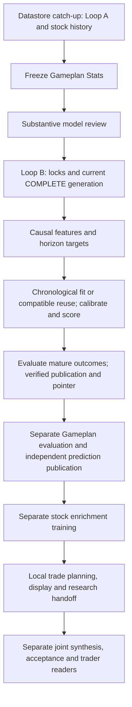

# Atlas Loop B and its scheduled responsibilities

**Observed October 10, 2026, Pacific time (`America/Los_Angeles`, PDT).** Source, native scheduler and saved-run observations were collected during 20:23–20:34 PDT; exact observation times and evidence keys appear below. This chapter describes Atlas. Scout must inspect and document its own PC. Native identifiers, absolute local paths, exact symbol membership, definitions and receipts remain in Atlas's dated private chapter.

Loop B turns completed Loop A data and other causally available features into **directional probabilities, evaluated historical predictions and a verified current intelligence publication**. Atlas currently invokes it as the first numerical stage of the split nightly **training/predictions** segment. Loop B is narrower than the Model Review Training and Predictions responsibility: Stats, substantive model review, independent Gameplan training/publication, stock enrichment, trade planning, display verification and the joint handoff have separate boundaries. [S1, S2, W1, N1, R1]

## Evidence levels

| Layer | Observation and what it establishes |
| --- | --- |
| Checked-in design | Ducketz HEAD `90704d21801f60426493bd6cc650a7fac38d4f61`. The prediction CLI, materializer, Loop A cycle contract, horizon and model code are clean tracked source, allowing for Git line-ending normalization. This is design evidence, not proof of loaded process bytes. [S1–S6] |
| Local uncommitted source | `ml/runtime_pipeline.py`, `ml/overnight_runtime.py`, runtime-lock and several Gameplan/UI files differ from HEAD. The split workflow, dispatcher, watchdog and newer runbooks are untracked local source. Current-source claims below refer to hashed private snapshots of those bytes, not implicitly to HEAD. [S2, S7, W1] |
| Installed coordination | Atlas profile; pinned release `7bd3da6cd674d78a6aafa01e1d4ecf3fbe66384a`; manifest and all 29 files verified. Source publication is authorized and routine coordination is GitHub-only. This is not an application deployment certificate. [C1] |
| Installed configuration | Local workflow selects eleven equities, archive-based independent-stock history, a separate substantive reviewer, bounded recovery and five responsibility owners. Exact bindings remain private. [C1, W2] |
| Scheduler registration | Fresh saved-definition/native database readback and Windows task readback establish registered status and timing. A wake or exit code does not establish model acceptance or numerical completion. [N1, N2] |
| Observed runtime | The latest relevant completed preparation used source session October 9 and action date October 12. Its Loop B publication and pinned downstream files pass the recorded hash checks. Its frozen source aggregate differs from current working bytes despite the same HEAD. [R1, R2] |

Only this chapter and an Atlas link in the shared index are owned by this documentation change. The existing Ducketz report and both PCs' historical chapters remain intact. No workflow, model fit, operational prediction, provider/broker request, task change or worker restart was performed to verify this chapter.

## Boundary, entry points and stage order

The actual bounded production entry is `python -m ml.prediction_runtime --once`, constructed by `ml.overnight_runtime` as `loop_b_directional_generation`. Atlas explicitly supplies its local watchlist, Databento, public horizons `1h 4h 1d 1w`, profile `loop-a-all-bsgp-active-v3`, logistic models, Platt calibration, a `0.001` round-trip cost and `--require-all-routes`. The Python function doing the numerical work is `ml.runtime_pipeline.run_loop_b_once`; the surrounding CLI supplies locks and current Loop A completion evidence. Directly invoking the function would not establish those production admission controls. [S1, S2, W1, R1]

The deterministic workflow runs `datastore_catchup → prepare_stats → model_review → train_and_plan → local_gameplan → verify_display → local_handoff`. The model owner covers two steps; `train_and_plan` starts at Loop B and stops after stock enrichment. Stock-only configuration omits the old `strategy_profit_training` and `strategy_generation` stages. OPRA history maintenance upstream does not prove that those omitted stages trained or ran. [W1, W2, R1]

The CLI also supports a recurring standalone owner, normally every 30 minutes at UTC `:06/:36`, one classified transient retry and startup freshness recovery. The old all-loops launcher describes that capability. Atlas's inspected production command uses `--once`, so it neither waits for that phase nor uses the recurring-cycle retry loop. No current independent recurring Loop B scheduler registration was found. The retained standalone design and its older run observations remain historical evidence. [S1, S8, N1, N2]

## Inputs, scope and causal clocks

Atlas's local profile, selected watchlist and completed-run evidence agree on an eleven-equity research universe. Membership is private; Scout's universe is not substituted. Loop B precedence is explicit `--symbols`, then an explicit watchlist, then datastore directory discovery. Atlas's production wrapper explicitly chooses its local watchlist. The separate Hyperliquid selection belongs to another stack. [C1, S1, W1, R1]

| Input | How it enters Loop B | Availability and historical boundary |
| --- | --- | --- |
| Completed Loop A market bars, calculated technicals, fundamentals and cross-domain signals | Point-in-time rolling materialization for each requested symbol/horizon | One input cutoff, source timestamps and feature availability; future or stale values cannot be silently made contemporaneous. Historical labels have their own completion clock. [S3–S5] |
| FMP/SEC fundamental and event context | Registered feature families, with missingness retained | Publication/filing availability matters; a current value is not evidence that it was known at an older decision. [S3, S5] |
| Verified ALFRED vintage macro features | Daily/weekly macro family | Importer lineage, no-lookahead readiness and minimum coverage are checked; ordinary current FRED observations are not historical vintage authority. [S3] |
| CME cross-asset context | Completed common-window context features | Causal availability and freshness control eligibility. It is not a same-cycle scheduling dependency on the independent CME owner. [S3] |
| Options quality histories | Receipt-backed snapshot features such as implied move, skew, term structure and quality | Snapshot availability and feature freshness govern use; no option orders arise from feature ingestion. [S3] |
| Active Pricing surfaces | Optional registered `opx__` family | Verified generation/receipt, first availability, coverage and freshness. Admissible absence can select the non-Pricing baseline; corrupt authority fails closed. [S3, S4] |
| Prior accepted Loop B runs and compatible models | Mature LIVE reconciliation, still-active carry and model reuse | Receipt-proven prior publication; exact model configuration/input compatibility; only outcomes visible by the cutoff. [S4, S6, S7] |

The requested v3 profile is a closed feature contract, not proof every family was admitted. Loop B checks active feature-set contracts before fitting. When the optional Pricing family lacks admissible coverage/freshness, it records quarantine and selects the registered baseline feature set; malformed authority or invalid mandatory macro readiness is an integrity failure. The saved run requested v3 but quarantined the Pricing family across all nine internal horizons and used the core family. [S3, S4, R1]

The clocks answer different questions: **source time** identifies the observation, **available-at** says when it could be used, **decision time** fixes the forecast's information set, **target window** defines the future return, **label availability** says when that outcome may enter evaluation/training, and **publication time** must satisfy the action deadline. The current Loop A generation's finish time is passed as the run's input availability cutoff; a future-known observation does not become legal merely because a later run can read its file. [S1, S3–S6]

### Horizons and targets

The public four-horizon selection expands the weekly family to `1w` plus `1w-d1` through `1w-d5`, giving nine internal model routes per symbol. The current LIVE weekly bundle can use a shorter remaining-week prefix. These are Loop B target definitions, distinct from the later independent-stock Gameplan targets. [S5, S6]

| Route | Meaning |
| --- | --- |
| `1h` | Next 60 eligible native one-minute marks, beginning at the next permitted segment open or local clock-hour start; target v6 also constructs eligible later starts within two hours of information availability. |
| `4h` | Next 180 eligible native one-minute marks from the defined 07:30/11:30/15:30/19:30 Eastern checkpoints. The label is a route name, not an assertion of 240 continuous minutes. |
| `1d` | Next eligible exchange session's open-to-close target; publication must precede that session's open. |
| `1w` and components | Frozen remaining-week first-open to final-close aggregate plus its contiguous eligible-session prefix. Weekly action deadlines use the first remaining component's close, and component routes use their session close. A later-week issuance may legitimately omit suffix components only when one coherent receipt-backed LIVE bundle proves that calendar geometry. |

Intraday source bars use the bounded 04:00–20:00 Eastern window. Eligible target minutes follow 07:00–09:25, 09:30–16:00 and 16:05–20:00 Eastern segments; early closes use the supported core-only policy. Sparse no-trade target minutes may use a strictly earlier native close only when collection coverage proves the target's end; they cannot borrow a future price. Targets subtract the configured round-trip cost exactly once, and the positive class requires cost-adjusted return strictly above zero. The default processing delay is five minutes; that delay and per-horizon actionability remain part of the versioned specification. [S5]

Loop B uses available normalized history. Producer bootstrap bounds are 100 calendar days for native one-minute bars, 1,825 for hourly bars and 2,555 for daily bars; these bounds do not prove all local history is present. Loop B does not itself fetch a longer archive to repair insufficient history. Later independent Gameplan training uses the separately configured archive path and target definitions; source identities cannot silently merge venue-specific XNAS history with an EQUS feed. Insufficient completed target clusters or unavailable target windows remain explicit route failures. An overnight run does not establish that every intraday forecast is still actionable when read the next day. [S3–S6, S9, W1, R1]

## Locks, readiness and complete generations

The prediction CLI holds its singleton runtime lock and then the shared Loop A/Loop B datastore OS lock across materialization, fitting and publication. The current singleton refuses a second live owner; replacement requires positive evidence that the original process exited, including a proven reused PID with a different birth time. Unknown ownership remains blocked. The OS lock serializes Loop A mutation with a complete Loop B read and releases on process exit; the small lock file's existence alone is not liveness. Workflow and overnight ownership controls are additional outer layers. [S1, S2, W1]

Admission reads the **current** Loop A cycle record and requires `COMPLETE`. Missing, unreadable, `WRITING` or `FAILED` current evidence rejects the attempt. The separate last-successful-generation record is not a fallback for Loop B. A newer failed or incomplete generation therefore blocks a new B cycle even when an older successful record exists. This guard does not itself require a same-session finish time, a maximum generation age or equality with Loop B's requested symbols/providers. Those matters require the surrounding readiness and subsequent per-source coverage, clock and route checks. [S1, S2]

Exact one-minute **bar readiness**, used by Pricing and Options, is a different publication contract. Loop B does not use that target-readiness pointer as its complete-generation admission test and does not wait on Pricing, Options, CME or daily ALFRED schedulers as phase barriers. Their feature evidence must still pass its own contracts. The saved input generation was core COMPLETE before the broader datastore catch-up finished its history tail. [S2, S3, S8, R1]

## Fitting, calibration, evaluation and publication

1. **Materialize and partition.** Build causal samples/labels, exclude compatible prospective LIVE target starts from offline reuse, then split chronological target clusters into training, calibration, assessment and sealed lockbox. Purge overlapping target windows across boundaries. Current defaults are train/calibration/assessment/lockbox minima of 160/40/40/80 for `1h`, 128/32/32/64 for `4h`, and 252/63/63/126 for daily/weekly. Training includes older eligible clusters beyond those minima. These are cluster requirements, not per-symbol raw row counts. [S4–S6]
2. **Fit or reuse.** Models are pooled by horizon across selected symbols, without a symbol feature. A model is reused only when its expected feature/target/cost/partition/input configuration and saved model bytes match. Otherwise fit a new generation; training needs both classes. This is compatibility reuse, not a champion-versus-challenger quality selection. [S6]
3. **Calibrate separately.** Platt is Atlas's requested method. Calibration uses its own later partition; a single-class calibration window falls back to identity calibration with an explicit status. Nondecreasing-map constraints and the effective method are recorded. Requested Platt does not prove a useful calibrated probability. [S6]
4. **Assess and infer.** Assessment produces BACKTEST scores and log loss, Brier, accuracy/support and baseline comparisons. Causally eligible current rows produce LIVE raw/calibrated probabilities. Mature receipt-backed LIVE targets are reconciled separately. Sealed lockbox outcomes cannot enter fitting/assessment; current dirty pipeline code removes closed-lockbox sample rows from public samples entirely, a change from the older report's redaction-only description. [S4, S6]
5. **Retain valid continuity.** Prior receipt-proven ordinary forecasts can be carried while their target remains active; weekly issuance is frozen under its own contract. Current dirty source prunes expired newly scored LIVE rows and, if a deadline crosses during promotion, rebuilds publication once from scored rows without refitting. It must not turn an expired forecast into a new decision. A missing weekly suffix is healthy only with coherent prefix proof; ambiguity remains stale. [S4, S7]
6. **Accept the generation.** Atlas requires all requested routes; the CLI's default partial-route tolerance is not this production setting. This is not an all-routes-LIVE promise: historical BACKTEST rows count toward ordinary route coverage, while weekly LIVE bundles have an additional check. Empty predictions, route failure under this setting, failed checksums/contracts or failed deadline/promotion checks cannot advance the authority. The immutable run's outputs and manifest are written first, then its verified `publication.json`, then one atomic `ml/latest/run.json` pointer replacement. Latest Parquet copies are compatibility mirrors, not the generation boundary. Ordinary pre-commit failures roll those mirrors back; an incomplete mirror rollback is reported explicitly. [S1, S4, S7, W1]

Model directories and their compatibility pointer retain reusable fit artifacts separately from the accepted prediction-run pointer. A successful fit or model pointer advance does not prove the entire Loop B run was accepted. No automatic age/count model-retention or historical-run deletion policy was found in the traced Loop B path. Later Gameplan model promotion and champion retention belong to that separate system. [S6, S7, S9]

Loop B records assessment and baseline-comparison metrics but does not require challenger superiority before saving its model or accepting a contract-valid run. Gameplan has its own promotion gate and can retain an accepted champion when a challenger fails. Similarly, the manifest verifier checks output sizes and hashes; it does not establish present provider health or revalidate every original mutable input against the run's old inventory. [S4, S6, S7, S9]

## Outputs and downstream consumers

All paths here are portable datastore-relative interfaces; private exact generations remain in Atlas's local evidence index.

| Output or relationship | Content and authority | Consumer / limitation |
| --- | --- | --- |
| `ml/runs/<generation>/samples.parquet` | Causal feature and target samples; current source excludes closed-lockbox rows | Strategy and historical-coverage planning; not a provider archive. [S4, S8] |
| `predictions.parquet` | Raw/calibrated probabilities, LIVE/BACKTEST identities, model and target/action clocks | Strategy, continuity and evaluation; receipt validity and actionability both matter. [S4, S7, S8] |
| `evaluations.parquet`, `monitoring.parquet` | Mature outcomes, probability errors, support, freshness/quality diagnostics | Model/research monitoring; incomplete outcomes are not scored as successes. [S4, S6] |
| `intelligence.parquet` | Readable probability, operational/model/live statuses and justified weekly N/A | Verified readers; the compatibility `ml-intelligence/latest/rolling-predictions.parquet` copy is not independent authority. [S4, S7] |
| `sequence-encoder-shadow.json`, manifest, publication and current pointer | Shadow diagnostics plus checksummed configuration/input/model/output lineage and accepted generation | Six run outputs in current source; shadow metadata is not an additional live trading model promotion. [S4, S7, R1] |
| Horizon model generations | Estimator/calibrator bundle, compatibility fingerprint and assessment evidence | Later compatible Loop B fits/inference; model files stay private. [S6] |
| Pricing and Options | Pricing surfaces and Options quality can flow **into** B | No direct B probability/model → contract-Pricing or Options-capture dependency was found. Shared cadence is not a data dependency. [S3, S8] |
| Options Strategy | Reads accepted B samples, LIVE probabilities, configuration and cutoff; adds exact chain/Pricing context | A separate runtime and separate profitable-outcome training. Atlas's stock-only nightly flow omits its strategy stages. [S8, W1] |
| Gameplan | Reads accepted B provenance/context where configured; independent-stock forecasts are trained/published in their own stage | Gameplan's independent targets, archive history, model promotion and retention are not interchangeable with B forecasts. [S9, W1] |
| Display and trader paths | Rolling Forecasts prefers the immutable nightly Gameplan when available and falls back to B; Stats and local/joint Gameplan readers validate their own receipts | Trader paths consume accepted frozen plans/source identities and their execution gates. Loop B publication alone does not establish display readiness, joint acceptance, trader liveness or an executed order. [S9, W1, R2] |
| Daily ALFRED coverage planning | Uses the current sample decision grid to plan historical coverage | Asynchronous feedback; not a same-cycle B→ALFRED barrier. [S8] |

## Task relationships on Atlas

All nominal times below are Pacific. Saved Codex recurrence strings lack an embedded TZID; Pacific intent is corroborated by prompts/workflow and native epoch readback. The Windows zone is `Pacific Standard Time`, which applies Pacific daylight-saving rules. Native next-run timestamps can differ by several minutes from nominal recurrence, so these are scheduling rules, not promises of an exact process start. [N1, N2, W1]

| Task / dispatcher | Observed state and Pacific recurrence | Model / effort | Entry point and exact relation to Loop B |
| --- | --- | --- | --- |
| Atlas Datastore Catch-up | ACTIVE; daily 21:05 | gpt-6-luna / low | Supervises upstream completed-session catch-up. May request `ml.nightly_workflow` datastore responsibility once when eligible; saved prompt requires configuration/Codex availability check. Produces prerequisites, not Loop B forecasts. |
| Atlas Gameplan Stats | ACTIVE; daily 03:00 | gpt-6-luna / low | Stats responsibility, dispatched after catch-up; scores mature outcomes and preserves pending horizons/no-history baseline. Owns dated 03:00 readiness-risk alert and native delivery confirmation. |
| Atlas Model Review Training and Predictions | ACTIVE; daily 03:00 | gpt-6-luna / low | Model responsibility exception checkpoint; requests one eligible model worker. Covers reviewer then numerical segment containing Loop B and distinct evaluation/stock-target/enrichment stages; does not rerun completed training. |
| Configured substantive reviewer | No independent schedule; coordinator invokes after Stats | gpt-6-astra / high | Read-only Codex CLI inference on frozen diagnostics; reviewed proposal precedes numerical stages. Proposal is not model promotion. |
| Ducketz Nightly Responsibility Dispatch | Enabled/Ready; daily 21:05, every five minutes, and logon | None; deterministic | `tools.nightly_watchdog` → `ml.nightly_workflow --dispatch`; launches only next eligible owner. Last scheduler exit 0 does not establish model or prediction acceptance. |
| Atlas Local Gameplan | ACTIVE; daily 03:00 | gpt-6-luna / low | Separate downstream Gameplan planning responsibility; requires this workflow's accepted prediction publication pin and original information cutoff. |
| Atlas Ducketz Display and Readiness | ACTIVE; daily 03:35 | gpt-6-luna / low | Display responsibility plus `ml.nightly_readiness`; verifies exact local/accepted combined readers. Owns dated 03:35 missed-confirmation alert and native delivery confirmation. |
| Atlas Joint Gameplan Handoff | ACTIVE; Mon–Fri 21:00–23:40, every 20 minutes | gpt-6-astra / ultra | Downstream private package delivery, returned-result adoption and final reader verification; can dispatch missed preparation once. Uses `tools.nightly_exchange`; Atlas does not perform Scout synthesis. |
| Atlas Joint Gameplan Handoff After Midnight | ACTIVE; Tue–Sat 00:00, 00:20, 00:40 | gpt-6-astra / ultra | Same logical handoff responsibility, keyed to prior evening. Final scheduled wake 00:40; separate 03:00/03:35 exception owners remain. |
| Atlas Priority Source Reconciliation | ACTIVE; Mon–Fri 21:00–23:40, every 20 minutes | gpt-6-astra / ultra | Source/request intake and single-owner repair coordination across stages; ordinary reconciliation once per enabled evening, Hyperliquid priority intake each wake. Not numerical Loop B. |
| Atlas Priority Source Reconciliation After Midnight | ACTIVE; Tue–Sat 00:00, 00:20, 00:40 | gpt-6-astra / ultra | Continuation of same evening; avoids a duplicate ordinary review. Can coordinate bounded evidenced restoration/repair, not independently bypass gates. |
| Atlas Trader Representative | ACTIVE; Mon–Fri 03:55, then hourly 04:05–17:05 | gpt-6-sol / ultra | Downstream accepted-plan/readiness and actual worker evidence consumer. Saved prompt has newer guarded task-specific start/restart grant requiring installed reviewed safe launcher; 17:05 is post-close audit only. This inspection establishes neither launcher installation nor trader outcome. |
| Ducketz Independent Stock Session | Disabled; retained weekdays 03:55 | None | Historical PowerShell stock-session launcher; inactive registration does not currently launch. Not a Loop B producer. |
| Loops Overnight Gameplan | PAUSED; retained daily 21:05 | gpt-6-astra / ultra | Historical monolithic `ml.overnight_runtime --scheduled --stock-only --independent-stock-horizons ...`; reference only. Current split workflow supersedes its scheduling role. |
| Loops Gameplan Weekly Review | PAUSED; retained Saturday 09:00 | gpt-5.6-luna / medium | Separate `ml.gameplan_evaluation` consumer of immutable historical Gameplans; retains pending horizons and verifies receipts. No fitting or provider refresh. |
| Finish Atlas and Scout overnight recovery | PAUSED; retained five-minute existing-chat heartbeat | Inherits chat; no saved override | Temporary recovery/completion follow-up, not routine Loop B stage. Saved latest prompt concerns finishing prior recovery's remaining native cadence/readback verification; no additional completion-follow-up definition found. |
| Ducketz Completed Scheduled Chat Cleanup | Enabled/Ready; every five minutes and logon | None | Pinned cleanup helper for eligible completed Codex chats. Administrative consumer of native chat outcomes, not numerical acceptance or Loop B completion. |
| Hyperliquid Operations Watch; Hyperliquid Paper Improvement | Both PAUSED; retained 30 minutes / two hours | gpt-6-luna / xhigh; gpt-6-luna / max | Separate crypto operating system; not this equity Directional Loop B. Listed to prevent conflating every model task with Loop B. |
| `ml.nightly_dispatch` and `ml.nightly_workflow` | Local source; no independent native recurrence | None for routing | Calendar/dependency routing, locked durable responsibility state and worker launch; model review is a separately invoked client. |
| `ml.overnight_runtime` | Invoked by an eligible workflow segment; no separate current registration | None | Constructs the bounded Loop B command, supervises its child, and records native stage/report/receipt evidence. |

[N1: saved TOML/native database readback October 10 20:27 PDT; N2: Windows readback 20:27 PDT; W1/W2: source/config 20:29 PDT.] Fifteen Codex definitions were found: ten active and five paused. Both after-midnight companions had no observed last wake. The temporary recovery heartbeat is the only saved existing-chat follow-up in this inventory; no separate Loop B completion-follow-up definition was found. The cleanup registration handles chat lifecycle, which is not numerical completion.

Windows dispatcher last readback was October 10 20:23:25 PDT, result 0, zero missed runs; cleanup 20:23:29, result 0. The disabled stock-session registration last reported September 15 03:55, result 1. Readback showed nominal-03:00 model supervision next scheduled for October 11 at 02:55:31; the cause of that native scheduling offset is unknown. Neither result nor timestamp proves a new numerical run. [N1, N2]

The five-minute dispatcher is deterministic and does not itself perform a model review. It selects one eligible unfinished responsibility under saved ownership/dependency state; the configured authenticated reviewer performs the substantive review using `gpt-6-astra` / high. Stats and review are prerequisites. The reviewed proposal feeds the later independent Gameplan path; it is not an argument to Loop B's fixed logistic/Platt command. A review proposal is not model promotion, and a model-supervisor chat's completion does not prove its numerical child completed. [W1, W2, N1]

## Failure, recovery and limits

The one-shot stage returns failure to the overnight supervisor. Reports retain stage starts/finishes, exit codes, logs and exact receipt hashes; healthy-owner checks prevent duplicate execution. The workflow saves the native run identity during progress, verifies completed outputs before reuse and resumes the same unfinished native stage when allowed. Loop B has no general mid-fit checkpoint resume; a later attempt may reuse only exact-compatible completed models. Datastore, workflow and stage ownership are separate locks; receipt verification is still required after an owner exits. [S1, S2, S6, W1]

The current dispatcher classifies transient, external-dependency and source-defect failures. It records a stable fingerprint and a five-minute cooldown; automatic attempts are bounded by local policy (at most three). Source changes and repair continuations require their own recorded review/transition, preserving completed stages and immutable original deadline evidence. Missed-night recovery is limited to the intended current action session, after 04:00 and before 17:00 Pacific, with an expiry no later than seven hours after approval or 17:00. A recovery heartbeat is not permission to recreate a completed run. [W1, W2]

The separate recurring B mode has at most one classified transient retry (default 60 seconds), immediate startup recovery for missing authority or a verified publication at least 35 minutes old, and fail-closed handling of corrupt authority. The retained standalone monitor warns after 35 minutes and fails after 45 minutes using publication availability; that historical continuous-runtime freshness policy must not be silently applied as proof that a once-per-night Atlas workflow failed. Current missing/stale features, target maturity, action deadlines and integrity still gate actual use. [S1, S8]

Successful publication establishes an accepted immutable forecast generation, not predictive skill or future availability. Stale/missing mandatory data can block a later run; optional valid missingness can degrade features; older accepted outputs stay historical and do not waive freshness. No current provider health, active recurring-owner process, future-session completion, live trader health or realized trading performance was established by this inspection.

## Latest saved run and verified outcomes

The inspected completed preparation used **source session October 9, 2026 → action date Monday October 12, 2026**, with an original Monday 04:00 PDT deadline. Datastore catch-up finished Friday 22:44:26 PDT, Stats at 22:48:38 and substantive review at 22:53:40. Loop B ran **22:53:40–23:20:21 PDT on October 9**; its accepted directional publication was promoted at **23:20:20 PDT**. Separate Gameplan evaluation, Gameplan publication and enrichment finished afterward; local planning finished Saturday 00:04:15 and local display/handoff at 00:08:31. [R1]

Verification at October 10 20:28–20:31 PDT checked four native segment receipts against their reports/logs and all 24 files pinned by the seven workflow steps. For Loop B it also checked the current pointer, `publication.json`, manifest, all six output hashes/sizes and corresponding latest copies. This confirms recorded accepted bytes, beyond the stage's exit 0. Aggregate results were **346,557 published samples, 6,991 BACKTEST plus 99 fresh LIVE predictions, 99 intelligence rows, 24,994 evaluations and 273 monitoring rows**. The log records nine trained horizon models and no reuse, with no route errors. At promotion there were 33 actionable ordinary routes and no in-progress ordinary routes; these counts are historical. [R1]

The Pricing feature family was quarantined on every internal horizon; admitted core feature sets supported the successful publication. The sequence encoder shadow was unavailable (zero coverage, no action authority), which did not prevent B publication. The requested profile, number of models and accepted pointer therefore do not prove that every optional input/model family participated, or that forecasts were profitable. Fitted-model files were not loaded or exported for this documentation. [R1]

Separate correct-schema checks verified 15 immutable nightly-Gameplan outputs, nine local trade-plan outputs and four Stats outputs. Gameplan's publication receipt does not use the overnight segment's COMPLETE/status schema; its publication timestamp and manifest checksum are the relevant fields. The local preparation state still says `LOCAL_COMPLETE_PEER_SETUP_PENDING`. Later separate exchange evidence records joint/UI readiness and local handoff verification: five pinned reader-evidence file hashes and dated joint/combined-Stats pointer relations match. The saved joint acceptance time is Saturday 03:25:51 PDT; supervision records final verification at 08:42:04. Its execution authorization remains false. These are preserved recorded outcomes, not a newly exercised UI or trader. Locally cached exchange evidence does not establish Scout's present native configuration. [R1, R2]

The completed workflow's source aggregate is `e52fbf441aaf30d464fa2566cd216bacaecc5eccf9a14d74bf1d90db7429a8fa`; the inspected current aggregate across 376 Python files is `ea1edfb927f743b3ff6435583cecd91f80c6a72413de541e8e7da428d6ea3988`. Both record HEAD `90704d21801f60426493bd6cc650a7fac38d4f61`. The aggregate mismatch is decisive: the successful run does not validate all current uncommitted source. The historical per-file source map was unavailable, so attributing that mismatch to a particular change would be speculative. [R1]

An earlier October 8 source-session attempt illustrates the boundary: its verified log reports numerical work followed by a deadline failure during atomic promotion, leaving prior authority unchanged. A later attempt completed B but failed separate trade planning. Subsequent planning recovery is a different outcome. This history is retained; neither numerical activity nor B success alone means the downstream workflow completed. [R1]

## Historical distinctions and discrepancies

| Earlier record | Current observation |
| --- | --- |
| Ducketz's existing directional Loop B report includes August 19 continuous-owner and 54-row UI observations | Preserved as history. They do not establish the current eleven-symbol Atlas nightly deployment or its runtime health. [S0, R1] |
| Older monolithic overnight documentation groups the full chain under one nightly supervisor | Current native definitions split datastore, Stats, review/predictions, local Gameplan and display; legacy monolithic task is paused. [W1, N1] |
| Generic B CLI publishes valid routes despite some route errors by default | Actual overnight command adds `--require-all-routes`. [S1, W1, R1] |
| Older report describes lockbox target redaction | Current uncommitted pipeline removes closed-lockbox rows; the past run cannot validate current working bytes merely because HEAD is unchanged. [S4, R1] |
| Older strict-deadline description implies any expired fresh row ends the cycle | Current uncommitted pipeline prunes expired fresh rows and can rebuild publication once from already scored rows. This is distinct from recurring transient retry. [S4] |
| Earlier Atlas task chapter records paused handoff/source/trader supervisors | Later retained observations and fresh readback show active revised windows and after-midnight companions. Keep the earlier dated state as history. [N1] |
| A workflow COMPLETE-like label or current pointer is treated as end-to-end success | Stage/log hashes, B receipt/manifest/output verification, independent Gameplan acceptance and later exchange acceptance establish different facts. Future trading remains unverified. [R1, R2] |

## Evidence index and observation times

Source keys refer to exact local snapshots collected October 10 **20:26:31–20:32 PDT**. Git-clean code can be inspected at the linked immutable HEAD; modified/untracked code is identified explicitly and its private snapshot is the citation authority. Line numbers refer to observed local source. Full hashes and line inventories remain in the private chapter.

| Key | Evidence and scope |
| --- | --- |
| C1 | October 10 20:27 PDT: active release, installation manifest, 29 exact file hashes and local profile readback. Manifest SHA-256 `e4d98044a79726ec44eb81b94997ac315af64cc500ef76d738ad0f34db471420`. |
| S0 | Existing [directional Loop B report](https://github.com/jeremysecondstate/ducketz/blob/90704d21801f60426493bd6cc650a7fac38d4f61/docs/loops-system-analysis/loops/directional-loop-b.md), including its September once-nightly banner and older August standalone observations; formatting/history only. |
| S1 | [Prediction runtime](https://github.com/jeremysecondstate/ducketz/blob/90704d21801f60426493bd6cc650a7fac38d4f61/ml/prediction_runtime.py): 28–32 defaults; 51–171 CLI; 258–363 locks/once/recurring execution; 391–461 recovery; 476–507 symbol precedence. Clean tracked; working-byte SHA prefix `4a9070d7dda0`. |
| S2 | [Loop A cycle](https://github.com/jeremysecondstate/ducketz/blob/90704d21801f60426493bd6cc650a7fac38d4f61/datafetching/loop_a_cycle.py): 27–56 validation, 99–167 current versus last-success, 199–233 OS lock. Modified `datafetching/runtime_lock.py`: 56–150, 174–195 owner identity/replacement; SHA prefix `5d4561c68af9`. |
| S3 | [Rolling materialization](https://github.com/jeremysecondstate/ducketz/blob/90704d21801f60426493bd6cc650a7fac38d4f61/ml/rolling_materialization.py): 239–358 normalized source/contract, 463–611 features, 608–979 causal families, 1169–1199 current-FRED exclusion, 1525–1689 source/target adjustment. `ml/datasets/families.py`: 120–147 freshness, 844–871 macro; `ml/feature_registry.py`: 811–844. `datafetching/fred_alfred_readiness.py`: 317–450, 630–677. |
| S4 | Modified `ml/runtime_pipeline.py`, working SHA prefix `97bec8a7200b`: 318–346 cutoff; 376–591 prior authority, profile admission, pooled fit/score; 614–736 expiry/route checks; 738–943 outputs/manifest; 1002–1180 deadline rebuild/atomic publication; 2486–2507 lockbox; 2740–3123 carry; 4370–4450 weekly coherence. Current bytes differ from HEAD. |
| S5 | [Horizons](https://github.com/jeremysecondstate/ducketz/blob/90704d21801f60426493bd6cc650a7fac38d4f61/ml/horizons.py): 159–384 targets, 387–480 profiles and weekly expansion. `ml/rolling_samples.py`: 280–347 labels, 364–463 intraday constituent rules; `ml/calendars.py` session geometry; `datafetching/databento_history_policy.py`: 12–18 and `app/services/market_fetch_specs.py`: 96–136 history bounds. |
| S6 | [Model runtime](https://github.com/jeremysecondstate/ducketz/blob/90704d21801f60426493bd6cc650a7fac38d4f61/ml/model_runtime.py): 76–89 cluster budgets; 167–338 purging/partitions; 409–552 pooled fit/calibration/model pointer; 566–713 compatibility; 716–821 assessment. |
| S7 | [Current publication reader](https://github.com/jeremysecondstate/ducketz/blob/90704d21801f60426493bd6cc650a7fac38d4f61/ml/current_publication.py): 67–130 and 188–308 immutable authority validation; `ml/artifacts.py`: 151–172 output verification; modified pipeline S4 for writer and continuity. |
| S8 | `ml/strategy_runtime.py`: 77–143 B consumption; `datafetching/fred_alfred_readiness.py`: 435–450 feedback; `ml/option_pricing_runtime.py`, `ml/option_pricing/operations.py`, `ml/option_pricing/consumers.py` and `options/publication.py` independent Pricing/Options boundaries; `ml/system_monitor.py`: 91–92, 386–396, 1296–1312 retained continuous-runtime freshness rules; `docs/datafetch-ml/start_all_loops.ps1`: 9–35 and `current_start_command`: 3–36 launcher history. No direct B→Pricing/Options consumer found in traced source. |
| S9 | Modified `ml/nightly_gameplan.py`: 206–262 separate archive path, 388–442 promotion/retention, 614–688 output/source binding; `ml/stock_trader/independent_training.py`: 635–652, 724–726; `app/ui/rolling_forecast_data.py`: 326–344, 385–419, 1460–1488; modified `app/ui/gameplan_data.py`: 721–802; modified `ml/stock_trader/gameplan_execution.py`: 1–60 and `independent_signals.py`: 41–88 downstream readers. |
| W1 | October 10 20:26–20:29 PDT: modified `ml/overnight_runtime.py`: 30–53 stage order, 384–405 boundaries, 446–518 commands, 608–610 feedback checks; untracked `ml/nightly_workflow.py`: 154–161 source identity, 220–268 segments, 296–354 reviewer, 393–557 display/frozen verification, 599–719 and 875–975 resume, 1009–1144 dispatch; untracked `ml/nightly_dispatch.py`: 16–38 steps/calendar, 53–173 recovery; untracked `tools/nightly_watchdog.py` and newer runbooks. Workflow SHA prefix `6acd2025f71c`; overnight `54c49f8380a7`. |
| W2 | October 10 20:29:02 PDT: local workflow configuration readback, privately hashed snapshot; substantive reviewer, ownership bindings, archive settings and bounded recovery. Stock-only selection is in W1 source, `ml/nightly_workflow.py`: 226. |
| N1 | October 10 20:27:29 PDT: all 15 saved Codex definitions, native database read-only definition/run readback and decoded prompts. Zero setting mismatches; exact original definitions and IDs stay private. Stability rechecked 20:31 PDT. |
| N2 | October 10 20:27 PDT: Windows task inventory/info and three XML exports; Windows timezone readback. No task invocation. |
| R1 | October 10 20:28:41 PDT: read-only saved state, native reports/logs, B current pointer/publication/manifest/output checks and source aggregate; historical attempts' hashes checked. Frozen-evidence/source stability rechecked 20:31 PDT. Exact paths and comparison results in private runtime-verification records. |
| R2 | October 10 20:29:17 PDT: separate saved exchange/supervision metadata, five pinned reader-file hashes and dated joint/combined-Stats pointer checks. No financial packet copied or fresh downstream execution. |

Private evidence preserves exact source hashes, original native definitions, local identifiers and receipt locations. Shared source links identify checked-in references only; dirty/untracked working-source claims are explicitly distinguished above and bound to the private snapshot inventory. The previous [Atlas scheduled-task chapter](scheduled-tasks.md) and [Atlas Loop A PR](https://github.com/jeremysecondstate/atlas-scout/pull/8) supplied formatting and labeled historical context, not proof of current settings.
