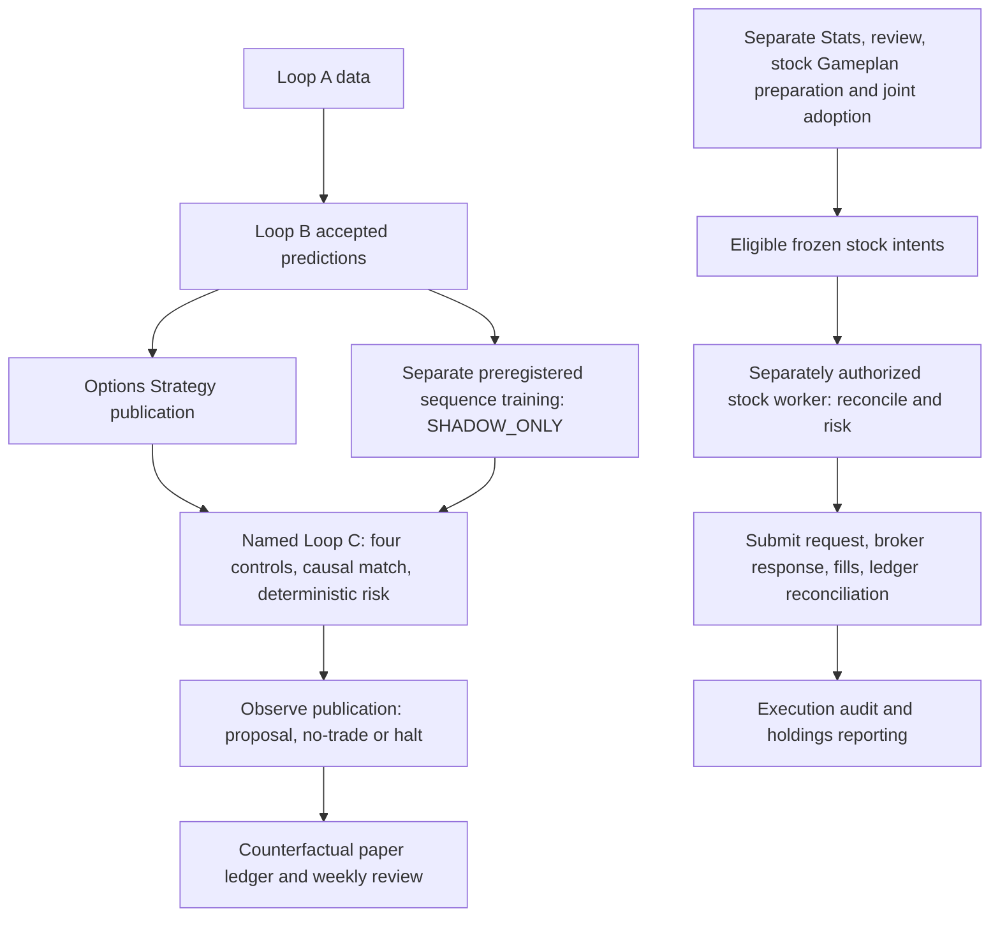

# Atlas: Loop C, its evidence boundary, and the separate stock execution path

**Observed October 10, 2026, Pacific time (`America/Los_Angeles`, PDT).** This chapter describes Atlas from local source, installed bindings, fresh native readback and retained runtime evidence. Observation times and evidence keys are indexed below. Exact symbols, native IDs, machine paths, controls and receipts remain in Atlas's dated private chapter. Scout must establish its own state. [C1, N1, R1]

## What “Loop C” means here

The precise named implementation is **`ml.loop_c`: an observe-only Options Strategy research and deterministic risk lane**. It joins a verified Strategy publication with a separately verified pooled sequence shadow publication, checks explicit operator controls and observed portfolio/broker inputs, and records a research proposal, no-trade, review or halt decision. Its runtime has no broker submission path. Its paper outcomes are counterfactual. Even a favorable rollout assessment cannot activate trading. [O1–O5]

The **Gameplan stock trader is a separate execution family**. Its current local independent-session and direction-policy paths can submit stock orders under their own enable gates, risk controls and operator authority. The older hourly Loop B trader, the named Loop C observer, pooled sequence training, stock horizon training, paper Gameplan executor, nightly preparation and Trader Representative are not interchangeable. This chapter traces the stock lifecycle separately because the older handoff/runtime documents and current operating system connect these topics. It does not transfer authority between them. [T1–T6, H1]

No `loops/loop-c.md` report exists in the inspected Ducketz `docs/loops-system-analysis/loops/` directory. The existing reports, Loop C rollout/risk documents, Atlas Loop A/Loop B chapters and task chapter supplied context and format; their dated assertions were checked afresh and retained as history, not rewritten. [H1, C1]

Arrows show source relationships, not evidence that each stage ran. There is no observer-proposal-to-stock-order edge in the inspected implementation. [O1, T1–T6]

## Evidence and authority layers

| Layer | What was established |
| --- | --- |
| Checked-in design | Ducketz HEAD `90704d21801f60426493bd6cc650a7fac38d4f61`; the 26-file observer/reference snapshot was clean tracked source. This establishes readable design, not loaded process bytes. [O1–O6] |
| Local working source | Several stock runtime, Gameplan, UI and lock files differ from HEAD; catch-up and split-nightly helpers include untracked source. Claims about those paths refer to exact private snapshots, explicitly distinct from the committed design. [T1–T6, W1] |
| Installed coordination | Atlas / `pc-original`; pinned release `7bd3da6cd674d78a6aafa01e1d4ecf3fbe66384a`; manifest and all 29 files matched. Profile selects GitHub-only routine coordination and authorizes source publication, with runtime deployment false. [C1] |
| Installed operating bindings | Atlas has a local research selection and a broader bound combined-stock execution universe. Native task prompts, selected policy and private exchange bindings are separate evidence from code defaults. [N1, N3] |
| Scheduler and process | Saved definitions, native database readback, Windows registrations and read-only process metadata establish only the observed registrations and process presence. [N1, N2] |
| Saved outcomes | Publication integrity, decision records, broker-response evidence, ledger observations and downstream acceptance have different scopes. None alone establishes an end-to-end successful trading session. [R1–R3] |

This request authorized documentation, read-only inspection and a reviewed branch/PR publication. It did not authorize a production run. No operational CLI, runtime import, provider/broker call, training, prediction generation, reconciliation, control change, scheduler change or worker start/stop was used for this chapter.

## Named Loop C: inputs, stage order and outputs

The component entry point is `ml.loop_c.runtime`, with an explicit decision timestamp and four explicit files. Input-only validation returns `READY_INPUTS`; that is neither a decision nor a publication. A normal invocation acquires the observer's exclusive runtime lock, reads accepted Strategy and sequence publications, aligns routes, evaluates risk, writes a timestamped decision/report/manifest, and optionally publishes through `--publish`. There is no internal hourly scheduler or retry loop in this CLI. Historical hourly wake instructions therefore require a separately installed owner. [O1, N1]

| Input or output | Direct role and consumer |
| --- | --- |
| Explicit risk approval | Exact schema, `APPROVED` status, observe-only scope, identity/rationale, chronological unexpired lease, model binding and finite typed risk limits. A pending proposal is inert. [O2] |
| Portfolio and broker snapshots | Direct numerical risk inputs; read-only/reconciled flags, nonfuture freshness, exact field schemas, expected source policy and confined source-receipt hashes. Values remain private. [O2] |
| Independent halt control | Explicit boolean state, issuer, issue time and expiry; expired, future or malformed controls fail before the observer runs. [O2] |
| Strategy publication | Direct candidate source: exact strategy identity, legs, costs, capital, loss, calibrated profit probability, net delta and target windows. Reader validates pointer/receipt/manifest/output integrity and the candidate score contract. [O1, O3] |
| Sequence publication | Direct shadow directional distributions: exact approved model/policy/configuration fingerprint/schema/consumer/horizon contract; authority must remain `SHADOW_ONLY`. [O1–O3] |
| Loop A and Loop B | Indirect lineage through accepted upstream publications. Sequence training binds a preregistered current Loop B generation; Strategy carries its own Loop B source record. The observer does not train Loop B or the sequence model. [O3, O6] |
| Pricing and Options | Strategy and sequence evidence lineage: Strategy uses option pricing/execution evidence; sequence surface materialization is separate. The observer does not launch Pricing, capture OPRA or fetch quotes. [O1, O3, H1] |
| Stats and stock Gameplan | No direct input dependency found in the named observer runtime. They belong to the separate stock planning/execution chain below. [O1, W1, T1] |
| Observer decision/report/manifest and optional publication | Immutable-run convention with checksummed outputs, publication receipt and atomic current pointer; consumed by paper tracking, weekly review and system monitoring. A valid no-trade record is an outcome, not a submission. [O1, O3–O5] |
| Paper ledger and weekly report | Receipt-verified reconstruction of exact proposals and mature Strategy outcomes; monitoring/reporting only. Neither output renews controls, retrains models, changes thresholds nor grants order authority. [O4, O5] |

The source helper calls one input projection `public_summary`, but it includes account fields. Its name does **not** make it suitable for shared documentation. No such projection, financial packet or full report was exported here. [O2]

### Clocks, routes and historical boundaries

The named observer inherits symbols from the accepted Strategy candidates and matches them to the sequence distributions; it does not select today's local watchlist independently. The sequence training stage freezes its own symbol list, source Loop B run, information cutoff, history bound and configuration in preregistration. Local equity research membership therefore cannot be assumed to equal an old observer cohort or the broader stock execution universe. [O1, O6, N3]

Sequence routes match symbol, horizon and decision timestamp; one-hour routes additionally require the target-window start. The loader rejects duplicate routes, null contract fields, automated-action flags and information available after the prediction's decision. It rejects a publication unavailable at the consumer cutoff and removes predictions created after that cutoff. Partial matched shadow coverage is allowed and reported; unmatched candidates do not become invented forecasts. [O3]

The model binding retains `1h`, `4h`, `1d`, `1w`, but Loop C option-paper candidates are restricted to **one-session `1d` and remaining-week `1w`** with a bounded exact-leg exit. The week is not invariably five sessions. Its target comes from the candidate and exchange calendar; each option's expiry must cover the target end. The runtime uses the XNYS **regular-session** market-open test, different from the extended stock session below. A closed market yields a blocked/no-trade decision if inputs can first be loaded; invalid input/publication evidence can instead stop the run before a decision is written. [O1, O4, H1]

No direct Loop A current-cycle or last-complete-generation check appears in the named observer entry. It consumes already accepted Strategy/sequence evidence and applies its own clocks. In contrast, the upstream production Loop B CLI calls `require_complete_loop_a_cycle`: a current WRITING/FAILED cycle cannot be replaced there by an older success. `read_latest_complete_loop_a_cycle` is a separate helper retaining a last-success pointer, with migration fallback only to a current COMPLETE cycle. Its existence is not a universal bypass. The stock route's readiness use is described separately below. [O1, O6, T2]

### Deterministic risk, authority and failure handling

Risk is a deterministic filter, not another learned trader. Global gates cover halt, session closure, model age, reconciled and fresh portfolio/broker evidence, daily loss, gross exposure, open-position count, working-order count and uncertain submission state. Halt or the daily-loss limit produces HALT. Other blocking conditions produce no-trade or review records. `OBSERVE_MODE` and non-active model authority are expected research-only reasons, never execution permission. Although the policy enum includes NORMAL, REDUCE_ONLY and FLATTEN, the shipped runtime calls OBSERVE and the engine still has no broker order method. [O1, O2]

Eligible candidates must pass horizon-specific Strategy probability, sequence directional support, expected return on risk, uncertainty and positive finite loss/capital gates. Directional structures use probability in their net-delta direction; effectively neutral structures receive no directional veto. Quantity is the minimum whole-unit capacity across per-trade loss, available cash, remaining gross exposure, remaining symbol exposure and the approved candidate cap. Expected utility subtracts an uncertainty penalty; the highest positive utility wins with candidate identity as deterministic tie-breaker. This is a proposed quantity, not a reservation or order. [O1]

The risk-proposal helper derives conservative equity-relative pending limits, including a downward-only account-history multiplier. The issuer validates the exact pending proposal/manifest/model binding and requires explicit identity, rationale, halt state and a Friday 17:00 Pacific expiry. It archives issuance evidence and replaces the two controls under a lock; replacement requires an explicit flag. Weekly review and expiry cannot self-renew that lease. The rollout evaluator's evidence floor can make a proposal eligible for operator review, but `authority_expansion_allowed` and `automatic_promotion_allowed` remain false. [O2, O5]

CLI failures return ERROR with exit 2 and zero-order safety fields. Missing, corrupt, future, expired or incompatible authority is not silently substituted with unverified predictions. The observer CLI's lock prevents concurrent owners; timestamped run output and atomic pointer replacement separate completed publication from partial output. The component has no general saved-stage resume, missed-hour catch-up or broker reconciliation mechanism. A failed later invocation does not make a retained older pointer fresh. [O1–O3]

The paper tracker verifies published observer evidence and exact Strategy candidates, reconstructs the frozen paper identity and deduplicates equal identities; conflicting duplicates fail. Identity includes the observer decision timestamp, so a new-time observation is not guaranteed to be the same paper entry. The ledger distinguishes `OPEN_PENDING_TARGET`, `PENDING_MATURE_OUTCOME_EVIDENCE` and `MATURE_RECEIPT_MATCHED`. It matches exact Strategy run/candidate/symbol/horizon/decision evidence. Interim marks are not final outcomes; absent exit evidence stays pending and never means harmless expiry. It models exercise/assignment obligations without carrying them into real inventory. Its separate lock and receipts establish paper processing only. [O4]

Integrity has limits: `verify_manifest` checks listed output sizes/hashes, not a fresh transitive replay of every historical input. Snapshot receipt validation binds a source-policy label, confined path and hash; it is not a broker re-query or cryptographic attestation of account truth. The observer has no separate current-Strategy-age limit in its entry point beyond the inherited route/publication contracts; model age is checked explicitly. These are implemented boundaries, not assurances about unexamined recovery cases. [O2, O3]

## Current stock execution family

### Entry points and upstream responsibilities

The current manual wrapper source invokes the managed stock-session launcher with wait-for-open, the `gameplan-direction-current-market-v1` sizing policy and explicit manual activation. The launcher constructs `ml.gameplan_stock_trader --target-horizon all --run-session --execute`; the all-horizon route enters `independent_session` and `independent_runtime`. The wrapper and launcher differ from HEAD. Their presence is not proof of a reviewed unattended launcher installation or a current running worker. [T1, N3]

The older `stock_trader.runtime` remains an hourly Loop B consumer, normally dry-run unless execution is requested. Its Gameplan adapter supports a historical single-horizon route, but the legacy runtime rejects combined-account mode. The paper-only `ml.gameplan_executor` is another boundary. The independent runtime also supports qualified learned enrichment and fixed horizon budgets; those paths have their own promoted-model requirements. Current Gameplan-direction execution consumes already accepted instructions instead of fitting or revalidating research models on every decision. [T1, T2, H1]

Atlas's actual preparation sequence is `datastore_catchup → prepare_stats → model_review → train_and_plan → local_gameplan → verify_display → local_handoff`. Stats freezes mature forecast evidence; a separate substantive reviewer accepts a model plan before numerical training/evaluation/prediction work. The stock-only training segment includes Loop B, independent stock Gameplan generation/evaluation/publication and enrichment; it omits the old Strategy-profit-training/Strategy-generation stages. Local planning then uses account-aware constraints and produces a frozen research package. Private exchange and peer synthesis return the combined plan and Stats for Atlas adoption. These are input preparation and acceptance, not stock execution or named Loop C observations. [W1, T6, R3]

Stats evaluates saved forecasts against market outcomes and feeds future model review/training. It does not turn projected quantities or modeled returns into real fills or realized account profit. The Gameplan display consumes verified planning/Stats publications; its rendered state is not a reconciliation certificate. The stock decision audit joins verified decision publications, execution events and mature evaluation evidence, but coverage of every newer catch-up identity by the legacy audit was not established. [T6]

### Scope, accepted inputs and session clocks

Atlas's verified local research selection is **eleven equities**; the accepted combined-stock execution universe is **twenty-two equities**. The combined receipt's participant scopes and local executor binding establish that distinction. Research membership remains local and is not overwritten by the execution union. The separate digital-asset selection is outside this chapter. Exact lists are private. [C1, N3, R3, T2]

Accepted Gameplan readers check action date, configuration fingerprint, participant/symbol membership, account binding, local source receipt hash and deployment/cutover prerequisites where configured. Joint execution requires the local actor to be the executor and the broker account to match. Conflicting joint and legacy selections fail. Frozen instructions retain unique identities, valid horizons/windows, finite probabilities and explicit abstentions; the reader does not reinterpret missing history as a usable model. Pointer existence alone does not satisfy these rules. [T2]

Stock targets are not the observer's option targets. The source defines 24 forecast rows per research symbol: thirteen executable hourly windows across 04:00–17:00 Pacific; one prior-close/open-gap research row; four executable four-hour targets at 04:00, 08:00, 12:00 and 16:00, with the last continuing into the next supported session; five daily rows, only the first executable and the later four outlook; and one five-session weekly target. Features must be available before the action session's 04:00 cutoff, and training labels require completed targets and source-correct history. The installed preparation selects archive stock history, while saved publications retain their own exact cutoffs and sources. No current datastore maximum timestamp can make future observations historically available. [T2, W1]

The stock worker uses supported full XNYS dates with an extended 04:00–17:00 Pacific session, PRE/REGULAR/POST distinctions and explicit Pacific DST construction. Unsupported half days are excluded from this extended-session contract. A pre-open manual worker can remain `SLEEPING_UNTIL_OPEN`, heartbeat locally and honor either disabled switch before any broker/model/inventory/slot activity. Ordinary first entries start at 04:01; the transition after 13:00 uses 13:06. Actual launch/awake/entry eligibility are different clocks. [T1, T2]

Neither the named observer nor the inspected stock execution entry directly requires Loop A's current COMPLETE generation. Stock execution requires accepted instructions and current execution evidence. The legacy hourly handoff can use an older-created, receipt-verified prediction only for the same still-actionable unconsumed target/horizon; it labels this `FALLBACK_ACTIONABLE_RECEIPT`. It cannot substitute another target or expired/unverified authority. This prediction-age fallback does not waive upstream Loop B's current-cycle requirement, and its waiter cannot be combined with a custom Gameplan loader. [T2, O6]

### From an eligible intention to a reconciled outcome

1. **Admission and ownership.** Both persistent stock switches must be valid/enabled, execution must be explicitly requested, the configured account/cutover/policy must validate, and session/cycle ownership locks must be acquired. Readiness or a task wake alone grants none of these. [T1, T3]
2. **Accepted intent.** The current Gameplan route selects the action-date plan and computes due frozen intentions. Accepted combined plans and native direction-ledger v4 use same-date catch-up; damage to a v4 authority does not silently fall back to an older reader. The historical route remains a current-hour reader. [T2, T4]
3. **Broker evidence and reconciliation.** The worker first obtains evidence for tracked orders, then account/open-order/quote state, retaining stable account identity and freshness. Complete cumulative fills update the horizon ledger, followed by reconciliation against the later portfolio snapshot. Unexplained inventory reductions create persistent review blocks. [T3, T5]
4. **Decision or no-op.** It recomputes residual intentions after reconciliation, excludes already recorded forecasts, verifies the selected source, handles separately guarded expired-entry cancellation where applicable, then builds risk-sized decisions. It publishes a decision run before any submission. A dry-run label stops the submission stage, but that CLI can still perform broker reads and local state writes; it was not used for documentation inspection. [T3–T5]
5. **Durable reservation and submission.** It rechecks activation, source, session, account, quote and portfolio guards; durably claims execution intent and inventory, plus account-wide reservation authority when configured; then sends a LIMIT request with another immediate pre-submit guard. [T3, T5]
6. **Response.** A proven pre-submit stop is `NOT_SUBMITTED_SAFETY_CHECK`. An uncertain/failed response or missing valid broker identity becomes `SUBMISSION_FAILED_OR_UNKNOWN`, retains the full reservation and stops the batch. A valid returned order identity records `SUBMITTED`; this is acknowledgement evidence, not a fill. [T3, T5]
7. **Later lifecycle.** Saved order evidence distinguishes working, partial, full, cancelled and rejected outcomes. Every filled share requires complete execution-leg evidence; a top-level filled quantity alone is insufficient. A fill still needs a subsequent consistent portfolio reconciliation. Cancellation requests remain awaiting reconciliation. Unknown/replaced/suspended states cannot be recovered by guessing a match from symbol, price or time. [T5]
8. **Exit and reporting.** Learned/fixed policies have owned expiry exits. Current Gameplan-direction holdings instead persist across forecast boundaries and sell on a later bearish instruction; they have no scheduled expiry liquidation. Decision publications, execution journals, holdings/reservations, session state and downstream audit/reporting remain separate records. [T3, T5, T6]

This describes implemented transitions. Saved runtime evidence below establishes only specific observed portions; it does not certify every branch or a fully reconciled session.

### Sizing, single-writer controls and recovery

Gameplan direction uses current literal cash, held-share capacity and current quotes. Bullish buys, bearish sells and neutral holds are distinct from upstream forecast training. Prices normally use ask for buys and bid for sells, with a defined wide-spread midpoint case and tick/offset checks. Quotes explicitly marked non-real-time are rejected; finite ordered prices and the selected quote clock must pass freshness checks. Confirmed real-time NBBO may use response-receipt time while retaining provider time; an unknown real-time flag is not itself rejected. Overnight price/cash ranges are estimates and are not execution gates. Whole-share quantities are capped by symbol/gross/single-order/cash-utilization limits, minimum notional and batch limits; horizon weights are 1:2:3:4. Pending buys consume capacity; unconfirmed sale proceeds cannot finance the same batch. Explicit sell capacities protect pending sells and other horizons, with a separately bound constrained fallback policy where selected. No private balances or configured monetary caps are published here. [T3]

Opposing same-symbol LIMIT orders at the same price are deferred when a conflicting working order exists, including manual orders or an earlier order from the current batch. Missing full working-order identities fails closed. Deferred intentions receive no new execution claim; this avoids treating a conflict as an executed or permanently consumed intention. [T3]

The session and cycle have separate exclusive locks. The working lock implementation checks PID, birth identity and a unique token under serialized maintenance; it can reclaim a proven exited/reused owner, not an unknown live owner merely because the file is old. Execution-intent SQLite uniqueness and synchronous durable claims precede human-readable event writes. The horizon ledger uses immediate transactions and reservation/idempotency checks; if an event artifact fails after a claim, suppression is favored over duplicate submission. These controls do not prove exactly-once external execution across every failure. [T5]

Current same-date Gameplan catch-up nets due frozen quantities against fills and open reservations. It does not target old absolute holdings or reverse unrelated manual trades. It retries unsubmitted due work after eligible slot starts; a no-signal pass does not clear a broker failure. Confirmed same-side rejected catch-up orders with broker identity require review. Historical learned/fixed paths attempt an hourly slot once and use their separate five-/ten-minute entry grace; an explicit dated opening exception is bounded to its original session. The specialized quote-recovery route requires one named same-date unsubmitted one-hour quote skip, unchanged source/prediction/end, no earlier event and a one-time claim. None is unrestricted backfill permission. [T2, T4, T5]

Interrupted preparation is handled by the separate dated workflow and repair ledger: frozen accepted stages may be retained under verified source transitions, with bounded attempts/cooldowns and immutable original/recovery deadlines. It is not permission to rerun a terminal session. Broker-response uncertainty remains a reconciliation blocker; no general unattended remedy was established. A worker heartbeat or eventual natural session exit does not prove every decision succeeded. [W1, T5, R2]

## Installed task relationships on Atlas

All states in this table were read **October 10 at 22:44 PDT**. Display names and portable entry points are given here; native IDs, exact actions and full definitions remain private. All fifteen saved Codex definitions matched the read-only native database. [N1, N2]

| Task or dispatcher | Observed status and Pacific recurrence | Model / reasoning | Entry and relationship |
| --- | --- | --- | --- |
| Atlas Datastore Catch-up | ACTIVE; Mon–Fri 21:05 | `gpt-6-luna` / low | Supervises eligible `ml.nightly_workflow` datastore responsibility; upstream Loop A/history preparation. [N1, W1] |
| Atlas Gameplan Stats | ACTIVE; Mon–Fri 03:00 | `gpt-6-luna` / low | Stats checkpoint and dated readiness-risk alert; dispatcher may run numerical Stats earlier after prerequisites. [N1, W1] |
| Atlas Model Review Training and Predictions | ACTIVE; Mon–Fri 03:00 | `gpt-6-luna` / low | Supervises model responsibility after frozen Stats. Separate substantive reviewer: `gpt-6-astra` / high; numerical training/evaluation/predictions remain upstream. [N1, W1] |
| Atlas Local Gameplan | ACTIVE; Mon–Fri 03:00 | `gpt-6-luna` / low | Supervises planning after accepted prediction inputs and verifies dates/cutoff/publication. [N1] |
| Atlas Ducketz Display and Readiness | ACTIVE; Mon–Fri 03:35 | `gpt-6-luna` / low | Local/combined UI-reader verification and dated missed-confirmation alert; no execution. [N1] |
| Atlas Joint Gameplan Handoff | ACTIVE; Mon–Fri 21:00–23:40, every 20 minutes | `gpt-6-astra` / ultra | `tools.nightly_exchange` supervision: private delivery, returned-plan verification/adoption; terminal sessions stay terminal. [N1, W1] |
| Atlas Joint Gameplan Handoff After Midnight | ACTIVE; Tue–Sat 00:00, 00:20, 00:40 | `gpt-6-astra` / ultra | Companion for the same handoff responsibility and receipts. [N1] |
| Atlas Priority Source Reconciliation | ACTIVE; Mon–Fri 21:00–23:40, every 20 minutes | `gpt-6-astra` / ultra | Reviewed source intake and repair routing; one ordinary intake per operating evening, ongoing repair supervision separate. [N1] |
| Atlas Priority Source Reconciliation After Midnight | ACTIVE; Tue–Sat 00:00, 00:20, 00:40 | `gpt-6-astra` / ultra | Same source responsibility, prior-evening identity avoids duplicate ordinary intake. [N1] |
| Atlas Trader Representative | ACTIVE; Mon–Fri 03:55, then 04:05 hourly through 17:05 | `gpt-6-sol` / ultra | Observes readiness/process/order-state evidence. Conditional guarded-start/repair authority has prerequisites described below; 17:05 is a closed-session audit. Not a second order engine. [N1, N3] |
| Finish Atlas and Scout overnight recovery | PAUSED; retained five-minute heartbeat | Inherits chat; no saved override | Temporary existing-chat completion follow-up, separate from ordinary cron responsibilities. [N1] |
| Loops Gameplan Weekly Review | PAUSED; retained Saturday 09:00 | `gpt-5.6-luna` / medium | `ml.gameplan_evaluation`: saved forecast/outcome scoring. Its historical native Loop C label does not make it the named observer or a trader. [N1] |
| Loops Overnight Gameplan | PAUSED; retained daily 21:05 | `gpt-6-astra` / ultra | Legacy monolithic preparation, reference-only after the split workflow. Old hourly identity is not a current hourly trader. [N1] |
| Hyperliquid Operations Watch | PAUSED; retained every 30 minutes | `gpt-6-luna` / xhigh | Separate digital-asset watch; outside the stock/observer paths. [N1] |
| Hyperliquid Paper Improvement | PAUSED; retained every two hours | `gpt-6-luna` / max | Separate digital-asset paper research. [N1] |
| Windows nightly responsibility dispatcher | Ready/enabled; daily 21:05, five-minute timer and logon | None | `tools.nightly_watchdog` → `ml.nightly_workflow --dispatch`; launches the next eligible preparation responsibility, no trader controls. [N2, W1] |
| Windows independent stock session | Disabled; retained Mon–Fri 03:55 | None | Historical PowerShell stock-session action; it lacks the explicit manual activation/direction-policy flags. A nominal next run does not enable it. [N2, T1] |
| Windows completed scheduled-chat cleanup | Ready/enabled; five-minute timer and logon | None | Pinned completion housekeeping; neither market completion nor trader supervision. [N2] |

No distinct current observer-hourly, pooled-sequence-training or paper-ledger registration was found among the fifteen local Ducketz Codex definitions and three Ducketz Windows tasks inspected. This bounded inventory does not prove no other unrecognized launcher exists. The old rollout's 01:42/02:42 sequence windows, hourly observer and 00:17 paper tracking are historical design claims, not installed Atlas scheduling evidence. [N1, N2, H1]

Native recurrence strings omit `TZID`; prompts specify Pacific/PST/PDT and October next-run readback aligns with PDT. Windows reports `Pacific Standard Time` with daylight-saving support; calendar starts are local wall time and five-minute timers use elapsed cadence. Coordinator source explicitly uses `America/Los_Angeles`. No future DST transition was exercised. Native actual queued times can differ from nominal checkpoints. Friday evening handoff/source windows continue into Saturday 00:40; morning supervision is now weekdays, while the independent Windows dispatcher remains daily/timer/logon and must still apply calendar/state eligibility. [N1, N2, W1]

At this observation, the Windows dispatcher and cleanup last results were 0. That establishes launcher exit status only. The disabled stock registration retained a September 15 last run with result 1 and missed-run history; neither that history nor its future nominal timestamp establishes a current worker. The bounded process scan found the application UI pair but no matching stock trader, nightly-workflow or exchange worker. It did not inspect loaded-module hashes. [N2]

### Manual controls and the conditional Trader Rep grant

The fresh Trader Rep definition retains an October 10 task-specific human grant for guarded automatic start and diagnosis/repair/restart when safe. It requires an installed reviewed trader-specific safe launcher, exact readiness and order-state reconciliation, one worker and respect for an explicit operator hold. It does not itself submit/cancel/replace orders or change controls. Other responsibilities retain their own narrower scope. [N1]

Saved October 10 installation-status evidence reports that safe wrapper as **staged/uninstalled**, with reviewed dependency installation and the disabled historical task action unresolved at that checkpoint. Fresh readback still finds the Windows stock task disabled; no reviewed safe-launcher installation proof was found in the inspected paths. The existing manual wrapper is not such proof. This is the limit of the inspection, not a categorical claim about every file on the PC. Older manual-only general documentation and the newer conditional task grant are preserved separately. This documentation task exercises neither. [N3, H1]

## Saved runtime evidence and its limits

The final saved-file collection was **22:48:16 PDT October 10**; the process and database observations have their own earlier timestamps below. No live workflow was started. [R1–R3]

| Evidence level | Saved finding | What it does not establish |
| --- | --- | --- |
| Named Loop C current authority | Canonical observer pointer/run directory and canonical sequence-encoder pointer/run directory were absent in the inspected datastore. Four observer controls remain, but approval/halt leases expired September 4 at 17:00 PDT; snapshots date to September 1 at 06:44 PDT. Their source-receipt hashes still match. [R1] | Neither old APPROVED/unhalted labels nor intact hashes make these inputs fresh or establish an eligible current run. Absence is scoped to the inspected canonical locations. |
| Historical paper processing | September 4 at 00:18:14 PDT: `NO_PAPER_TRADES_YET`, zero verified observer runs and zero paper entries; pointer/receipt/manifest/output checks passed. [R1] | This is a verified historical empty ledger, not a fresh no-eligible-work determination or a successful observer decision pass. |
| Historical weekly review | August 29 at 21:14:19 PDT: `INSUFFICIENT_LOOP_C_OBSERVATIONS`; receipt, manifest, report/Markdown and listed historical input hashes passed. [R1] | REVIEW_ONLY does not renew controls, activate a model or establish trading performance. |
| Separate stock launch/session | Trading/action date October 9; launched 13:28:37 PDT, worker recorded start 13:28:38, final heartbeat 17:00:00. Terminal `FINISHED_WITH_ERRORS`, with two recorded failed cycles. [R2] | A launched and naturally terminated worker is not a successful whole session. |
| Latest stock decision stage | The closing pass recorded `EXECUTION_WINDOW_CLOSED_AFTER_BROKER_CAPTURE`. Its pointer/receipt/manifest/decision and two accepted-plan input hashes matched. It selected no decisions in that pass. [R2] | This final no-op cannot be generalized to the session: earlier log entries include both submitted and non-submitted passes. |
| Submission and acknowledgement | A separately inspected late-session submission event matches its decision receipt and records `SUBMITTED` with a broker acknowledgement identity. [R2] | An acknowledgement is not a fill; no order identity, payload or financial detail is shared here. |
| Fill and reconciliation-stage evidence | Read-only saved-ledger inspection found fill records linked to reservations and a later inventory snapshot marked ready. [R2] | This is neither a fresh broker reconciliation nor proof every submission filled, every fill reconciled, all inventory exited or the session completed successfully. The sampled acknowledgement and saved fills are not asserted to be the same order. |
| Newer accepted planning | Source session October 9 → action date October 12. Local preparation finished October 10 at 00:08:31 PDT; 24 pinned step outputs matched. Joint-plan acceptance records 03:25:51 PDT; the separate handoff receipt and five pinned reader files matched. [R3] | This establishes accepted planning/display evidence for a later date, not October 12 trading. The handoff explicitly records execution authorization false. |

The October 9 stock log's earlier failure was `ACCOUNT_RESERVATION_AUTHORITY_UNAVAILABLE`, with a recorded unavailable-quote condition for pending buy exposure. The closing-window gate was the other recorded failed cycle. Empty stderr does not override these saved errors. Stock switches currently retain enabled confirmation state, but controls, execution-request metadata, prior acknowledgement and present liveness are separate facts. No inspected stock artifact provided a comprehensive source-byte identity for the old worker. [R2]

The October 12 preparation's original state remains `LOCAL_COMPLETE_PEER_SETUP_PENDING`. The later separate receipt says `HANDOFF_VERIFIED_LOCAL`, joint/UI ready and execution not authorized; its dated pointer equals the immutable accepted-plan object. These are sequential evidence layers, not contradictory labels to overwrite. The earlier stock session consumed the October 9 accepted plan, not this newer one. Current and last-complete Loop A pointers agree on a completed generation finished October 9 at 21:31:35 PDT. [R2, R3]

The completed preparation records source digest `e52fbf441aaf30d464fa2566cd216bacaecc5eccf9a14d74bf1d90db7429a8fa`. The current 376-Python-file map has digest `ea1edfb927f743b3ff6435583cecd91f80c6a72413de541e8e7da428d6ea3988`, despite the same Git HEAD. The comparison follows the workflow's `ml`/`datafetching`/`app` Python aggregation and excludes tools, shell launchers and non-Python configuration. The historical per-file map is not present in the inspected run evidence. Thus the saved successful preparation does not validate current edited bytes, and the mismatch cannot be reliably attributed to one particular file. [R3]

Hash verification here covers the specified observer/paper/review chain, latest stock decision and sampled submission-event linkage, 24 preparation outputs and the five acceptance/display links. It does not rerun inference, validate every model/raw dataset, authenticate historical broker truth or audit all historical executions. The database inspection remained read-only; no database or financial packet was copied into publication. Process absence is a bounded observation, not a guarantee that no differently named worker existed. Future-session operation, current loaded source, comprehensive execution-to-Stats attribution and recovery from every ambiguous broker state remain unverified. [R1–R3, N2]

## Discrepancies and retained history

| Earlier claim or ambiguous name | Reconciled current finding |
| --- | --- |
| “Loop C” used as a broad trader label | Literal `ml.loop_c` is the observe-only options lane. Gameplan stock execution, its risk/ledger and Trader Rep are separate. [O1, T1, N1] |
| Old hourly handoff prompt | Its current text redirects to nightly Gameplan and stock automation and says earlier design prompts are not operating instructions. No hourly observer registration was found in the scoped current inventory. [H1, N1] |
| Rollout timing or forty-session/eight-cohort floor | Research eligibility policy; no automatic promotion or order authority. Old clock windows are not current task readback. [O5, H1, N1] |
| Older stock runtime says scheduled independent worker starts at 03:55 | Current Windows stock task is disabled. Manual wrapper source and conditional Trader Rep authority do not establish installed unattended launch. [N1–N3, T1] |
| Independent-signal docstring says missed slots are not replayed | Its early execution-ready branch now uses accepted-plan/v4 catch-up. Historical qualified paths retain their narrower slot behavior. [T2, T4] |
| Every horizon automatically expires its holding | Current Gameplan-direction holdings persist until later bearish instructions; learned/fixed expiry policies remain distinct. [T3] |
| Learned enrichment required for all stock execution | Current Gameplan-direction route consumes frozen accepted directions; learned and fixed alternatives keep separate gates. [T1–T3] |
| Earlier Atlas Loop A/B and noon task inventory | Preserved history: paused supervisors later became active with revised windows; the five preparation checkpoints observed daily in Loop B are now weekday rules. No historical chapter was rewritten. [N1, H1] |
| General manual-only runbook versus fresh Trader Rep prompt | The October 10 task-specific conditional human grant is retained separately from unresolved safe-launcher installation evidence. This inspection changes neither. [N1, N3] |
| Successful saved preparation or a COMPLETE-like label validates current source and trading | Current source digest differs; accepted planning, submitted request, acknowledgement, fill, reconciliation and downstream completion require separate evidence. Latest stock session explicitly ended with errors. [R2, R3] |

These are documentation findings. Application defects or ambiguous recovery behavior were not repaired under this documentation-only request. Historical chapters, peer paths, operating state and other writers' source remain preserved.

## Source and native-evidence index

All times below are **October 10, 2026 PDT**, with UTC equivalents where useful. Source line ranges refer to the exact observed local snapshots. Immutable Git links identify checked-in references only; modified/untracked working-source claims are bound to the private SHA-256 inventories, not falsely attributed to HEAD. Full hashes, original native definitions and exact private references accompany the private chapter.

| Key | Evidence, observation time and scope |
| --- | --- |
| C1 | 22:40–22:43 PDT: checkout instructions, active pointer, verified manifest and 29 files, local profile/watchlist, pre-edit dirty/source inventories; atlas-scout origin and main `480e531e415518aa3d0f3e7c75788d0d547764dc` verified by fetch and remote readback. Manifest SHA-256 `e4d98044a79726ec44eb81b94997ac315af64cc500ef76d738ad0f34db471420`. Coordination rules and earlier Atlas chapters inspected before editing. |
| O1 | 22:44:40 PDT / 05:44:40Z: clean tracked [observer runtime](https://github.com/jeremysecondstate/ducketz/blob/90704d21801f60426493bd6cc650a7fac38d4f61/ml/loop_c/runtime.py), lines 40–191 stage order/output, 198–300 delta direction, 303–312 calendar, 331–412 entry/binding; [risk engine](https://github.com/jeremysecondstate/ducketz/blob/90704d21801f60426493bd6cc650a7fac38d4f61/ml/loop_c/engine.py), 47–164 decisions, 177–329 gates/quantity. |
| O2 | Same 22:44:40 snapshot: [input contracts](https://github.com/jeremysecondstate/ducketz/blob/90704d21801f60426493bd6cc650a7fac38d4f61/ml/loop_c/inputs.py), 42–130 bundle/private fields, 133–218 approval, 250–458 snapshot/halt/receipt checks; `ml/loop_c/policy.py`:22–100 modes/binding; `risk_proposal.py`:32–189 pending calculus; `operator_controls.py`:37–250 issuance/lease/locking. All clean tracked. |
| O3 | Same snapshot: [observer publication](https://github.com/jeremysecondstate/ducketz/blob/90704d21801f60426493bd6cc650a7fac38d4f61/ml/loop_c/publication.py):35–134; `ml/strategy_publication.py`:91–177 accepted Strategy; `ml/sequence_encoder/publication.py`:35–198 shadow pointer/receipt; [sequence consumer](https://github.com/jeremysecondstate/ducketz/blob/90704d21801f60426493bd6cc650a7fac38d4f61/ml/sequence_encoder/consumer.py):27–209 route/clock/authority; `ml/artifacts.py`:151–172 output-hash scope. Clean tracked. |
| O4 | Same snapshot: [paper ledger](https://github.com/jeremysecondstate/ducketz/blob/90704d21801f60426493bd6cc650a7fac38d4f61/ml/loop_c/paper_ledger.py):58–302 frozen identity/exit/obligations; 335–478 publication; 481–608 verification/dedup; 648–735 outcome; 863–901 lock/CLI. Clean tracked. |
| O5 | Same snapshot: `ml/loop_c/weekly_review.py`:111–225 attribution/authority, 293–354 acceptance; [rollout](https://github.com/jeremysecondstate/ducketz/blob/90704d21801f60426493bd6cc650a7fac38d4f61/ml/loop_c/rollout.py):11–110 immutable no-promotion boundary; `ml/system_monitor.py`:3602–3782 observer/sequence/paper inspection. Clean tracked. |
| O6 | Same snapshot: `ml/sequence_encoder/runtime.py`:81–152 frozen preregistration and accepted Loop B; [Loop A cycle](https://github.com/jeremysecondstate/ducketz/blob/90704d21801f60426493bd6cc650a7fac38d4f61/datafetching/loop_a_cycle.py):99–167 current and last-success behavior; `ml/prediction_runtime.py`:340–363 production B admission. Clean tracked. |
| T1 | 22:42:46–22:44:44 PDT: modified `Start-Gameplan-Trader.cmd`:1–11 and `docs/datafetch-ml/start_stock_session.ps1`:1–93,127,262–342; clean tracked [Gameplan entry](https://github.com/jeremysecondstate/ducketz/blob/90704d21801f60426493bd6cc650a7fac38d4f61/ml/gameplan_stock_trader.py):19–55,103–139; `ml/stock_trader/runtime.py`:134–223 legacy route; modified `independent_session.py`:139–332. Snapshot/source status recorded privately. |
| T2 | Same source window: modified `ml/stock_trader/contracts.py`:11–23 scope; `gameplan_execution.py`:22–239 accepted/fallback instructions; `independent_signals.py`:41–161 branch/qualification; untracked `ml/joint_capital_adoption.py`:125–136 executor binding; clean [stock targets](https://github.com/jeremysecondstate/ducketz/blob/90704d21801f60426493bd6cc650a7fac38d4f61/ml/independent_stock_targets.py):75–219; `ml/stock_trader/handoff.py`:106–129,168–285; `gameplan.py`:30–103; `session.py`:39–133. |
| T3 | Same source window: modified `ml/stock_trader/independent_runtime.py`:50–114 conflicting orders,270–422 admission/model boundaries,432–674 capture/reconcile/decide,856–1067 cancel/reserve/submit; modified `gameplan_direction_engine.py`:31–90 quote authority and 199–361 sizing; modified `contracts.py`:65–83 quote clocks,175–231 risk; clean `state.py`:51–100,170–200,272–313 quote/cash/reservations; `fixed_horizon_engine.py` joint budgets. |
| T4 | Same source window: untracked `ml/stock_trader/catchup.py`:18–112 v4/current plan and residual intentions; modified `gameplan_execution.py`:197–239 current versus historical branch; clean `quote_recovery.py`:24–98 bounded recovery. |
| T5 | Same source window: modified `datafetching/runtime_lock.py`:70–124,161–190 ownership; clean `ml/stock_trader/publication.py`:44–165 decision publication,197–305 durable intent; modified `horizon_broker.py`:73–266 order evidence; modified `horizon_ledger.py`:244–257,421–611,861–924 reservation/fill/reconciliation; modified `independent_session.py`:227–332 session guards/retries; modified `ml/account_gameplan/execution.py`:95–245 and `config.py`:82–144 account-authority bindings/claims. |
| T6 | Same source window: clean `ml/stock_trader/audit.py`:37–144 and `execution_lifecycle.py`:22–80,289–314 audit seams; modified `ml/gameplan_actuals_review.py`:405,477 forecast attribution; untracked `ml/gameplan_model_feedback.py`:68–78,201–218,252–260 feedback; modified Gameplan UI/data readers. |
| W1 | 22:46:01 PDT / 05:46:01Z: exact workflow/config/launcher snapshots. Untracked `ml/nightly_dispatch.py`:17–37 stage order/calendar and 53–173 recovery; `ml/nightly_workflow.py`:154–161 source hash,220–268 stages,296–354 reviewer,393–557 display/frozen verification; `tools/nightly_watchdog.py`:64–113 bounded dispatch. Modified `ml/overnight_runtime.py`:30–53,384–518 numerical segments. Local workflow configuration selects archive history, separate reviewer, responsibility bindings and bounded recovery. |
| N1 | 22:44:00 PDT / 05:44:00Z: all 15 original saved Codex definitions plus read-only native database definition/run readback; zero name/state/recurrence/model/effort/notification/prompt mismatches. Historical run metadata is not execution proof. |
| N2 | 22:44:00–22:44:01 PDT: three Windows registration/info/XML readbacks, system Pacific/DST configuration and bounded CIM process snapshot. Raw native IDs/actions/principals/commands are private. |
| N3 | 22:46:01 PDT: private workflow/binding and October 10 schedule-change installation-status records, current manual-launcher source and fresh disabled stock registration. No new safe-wrapper installation proof found in scoped evidence. Local symbol scope cross-checked against profile and accepted plan. |
| R1 | Final saved-file collection 22:48:16 PDT / 05:48:16Z: canonical observer/sequence absence; four controls and source receipts; historical paper/weekly pointers, receipts, manifests, output and listed weekly-input hash checks. Exact paths/hashes retained privately. |
| R2 | Saved stock snapshot 22:48:16 PDT; process scan 22:46:24; read-only ledger aggregates 22:46:50; whole-log digest and sampled submission-event linkage 22:47:13. Separate October 9 session, latest decision and its accepted inputs, retained switches, acknowledgement/fill/reconciliation evidence. No fresh execution/reconciliation. |
| R3 | 22:48:16 PDT: dated preparation state, all 24 pinned step outputs, accepted joint selection, five pinned reader files and handoff receipt, Loop A pointers, source aggregate/current 376-file map. Historical per-file runtime-source identity unavailable. |
| H1 | Observer references at 22:44:40 and stock references at 22:48:02 PDT: [rollout](https://github.com/jeremysecondstate/ducketz/blob/90704d21801f60426493bd6cc650a7fac38d4f61/docs/loops-system-analysis/LOOP_C_ROLLOUT_PLAN.md), [risk calculus](https://github.com/jeremysecondstate/ducketz/blob/90704d21801f60426493bd6cc650a7fac38d4f61/docs/loops-system-analysis/LOOP_C_RISK_CALCULUS.md), [pooled sequence](https://github.com/jeremysecondstate/ducketz/blob/90704d21801f60426493bd6cc650a7fac38d4f61/docs/loops-system-analysis/POOLED_SEQUENCE_LOOP_C.md), stock runtime/automation, independent horizons and hourly handoff documents. Atlas's [task chapter](scheduled-tasks.md), [Loop A PR](https://github.com/jeremysecondstate/atlas-scout/pull/8) and [Loop B PR](https://github.com/jeremysecondstate/atlas-scout/pull/9) supplied format and explicitly dated history. |

The publication owns only this Atlas chapter and an additive Atlas link in the shared index. Pending Atlas/Scout Loop A/B index changes were checked with three-way merges, and their additions remain independent. Shared-byte privacy review excludes credentials, exact symbols/native bindings, account state, order/fill details, financial packets, raw data, models, task memory and private receipts. No Ducketz source completion queue was used for atlas-scout documentation; publication, main integration, local installation and runtime deployment remain separate facts.
