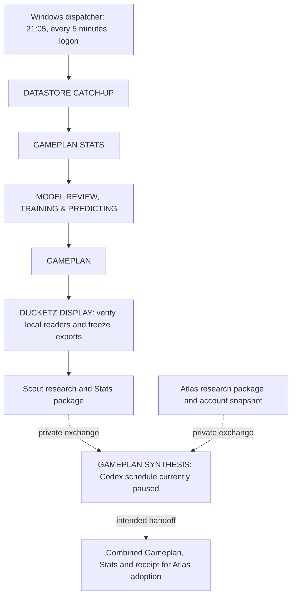

# Scout: Codex and Ducketz scheduled tasks

**Inventory date:** October 10, 2026, approximately 11:30–11:36 a.m. PDT

**Machine identity:** Scout

**Time zone:** America/Los_Angeles; all wall-clock times below are Pacific

**Purpose:** Scout's chapter in the shared [Codex–Ducketz system details](../README.md), to compare with Atlas's independently verified inventory.

This shared reference records Scout's saved schedules and responsibilities at the inventory time above. It was prepared from read-only inspection without starting workflows or changing operating settings. The private original retains native task identifiers and machine paths; this version documents the behavior, schedules, observed state, and comparison points for both PCs. Copying this document does not install a task or replace either PC's bindings.

## 1. What is installed here

Scout currently has **11 Ducketz Codex scheduled tasks: five active and six paused**. All eleven are local project cron tasks. The current scheduler inventory contains **no Ducketz heartbeat tasks**. An unrelated Housez automation was excluded.

Windows Task Scheduler separately contains **two enabled Ducketz support tasks**: the nightly dispatcher and completed-chat cleanup. They run deterministic programs; they are not additional Codex model prompts.

Seven of the Codex tasks describe the current split nightly responsibilities. Five of those seven are active. **GAMEPLAN SYNTHESIS and REPO RECONCILIATION are paused**, despite their prompts describing recurring work. The other four paused tasks are the two Hyperliquid tasks and two retained Loops tasks.

| Layer | What it contributes | Current inventory |
| --- | --- | --- |
| Codex scheduled tasks | Responsibility supervision, reasoning, diagnosis, approved repair, and reporting | 5 active; 6 paused |
| Windows nightly dispatcher | Periodic and logon dispatch of eligible deterministic workflow stages | Enabled |
| Windows completed-chat cleanup | Narrow archival of eligible completed scheduled chats | Enabled, with a current cadence mismatch described below |
| Ducketz workflow and receipts | Dependency ordering, action dates, locks, completion evidence, and resumable stages | Shared by the responsibility tasks and dispatcher |
| Atlas | Peer research package, account snapshot, exact combined-plan adoption, and existing execution ownership | Atlas's actual schedules must be inventoried on Atlas |

An active schedule means the scheduler may launch that task. It does not prove the task ran successfully or that tonight's preparation, handoff, UI state, or trading runtime is ready. A paused task retains its definition but does not receive ordinary scheduled launches.

## 2. Codex schedule at a glance

These are the **saved nominal recurrence times**, not promises of second-exact starts. Scheduler next-run timestamps can differ from those times; the workflow's eligibility checks and dispatcher control which stage may actually launch. Daily schedules still use the exchange calendar and action-date rules to decide whether work is due.

| Exact name shown in Codex | State | Saved schedule | Saved model | Reasoning |
| --- | --- | --- | --- | --- |
| Scout DATASTORE CATCH-UP | **ACTIVE** | Daily 21:05; 04:05 catch-up fallback | `gpt-6-luna` | Low |
| Scout GAMEPLAN STATS | **ACTIVE** | Daily 21:05 | `gpt-6-luna` | Low |
| Scout MODEL REVIEW, TRAINING & PREDICTING | **ACTIVE** | Daily 21:05 | `gpt-6-luna` | Low |
| Scout GAMEPLAN | **ACTIVE** | Daily 21:05 | `gpt-6-luna` | Low |
| Scout DUCKETZ DISPLAY | **ACTIVE** | Daily 03:00 and 03:35 | `gpt-6-luna` | Low |
| Scout GAMEPLAN SYNTHESIS | **PAUSED** | Every 20 minutes when enabled | `gpt-6-astra` | Ultra |
| Scout REPO RECONCILIATION | **PAUSED** | Every 20 minutes when enabled; routine daily source review at the first eligible wake after 01:25 | `gpt-6-astra` | Ultra |
| Hyperliquid Operations Watch | **PAUSED** | Every 30 minutes when enabled | `gpt-6-luna` | Low |
| Hyperliquid Paper Improvement | **PAUSED** | Every hour when enabled; adaptive cadence also described in its prompt | `gpt-6.1-sol` | Medium |
| Loops Overnight Gameplan | **PAUSED** | Daily 21:05 when enabled; retained legacy definition | `gpt-6-astra` | Ultra |
| Loops Gameplan Weekly Review | **PAUSED** | Saturdays 09:00 when enabled | `gpt-5.6-luna` | Medium |

21:05 is 9:05 p.m.; 04:05 is 4:05 a.m. Models above are the actual saved settings, not model recommendations. The substantive model-review subprocess has its own stronger setting, described below.

All eleven target the local Ducketz project. Their saved working-directory context includes the application checkout, local DATASTORE, private CODEXSTORE mount, and Atlas–Scout coordination checkout. This does not make every file in those locations publishable or grant every task permission to perform every operation.

## 3. How the nightly responsibilities fit together

There is **one durable action-date workflow on Scout**, with distinct responsibility owners. Four tasks waking around 21:05 do not each start a complete overnight pipeline. Each checks the same workflow and may launch only its eligible responsibility. A completed prerequisite can dispatch the next stage without waiting for its next daily Codex checkpoint.

The diagram describes responsibilities and dependencies; its downstream arrows do not assert that synthesis or handoff currently runs automatically. The paused synthesis schedule is a separate fact from the active preparation dispatcher.

The intended kickoff is 21:05 Pacific. The original action-date deadline is 04:00; the 04:05 catch-up checkpoint does not reset that deadline or establish an on-time completion. The 03:00 and 03:35 display wakes cover readiness-risk and missed-confirmation reporting. They do not forbid earlier startup or replace dependency dispatch. Weekends, holidays, DST, interruptions, and late recovery retain the workflow's recorded action date and cutoff rules.

### Scout DATASTORE CATCH-UP

**Owns:** The `datastore` responsibility and its `datastore_catchup` stage.

It checks the private workflow configuration, then requests the eligible datastore responsibility with catch-up semantics. It updates Scout's existing eleven-symbol data/history using the native coverage and bounded-overlap rules. The output is verified catch-up evidence and honest reporting of remaining gaps, which become prerequisites for Stats.

Its 21:05 wake supports the ordinary kickoff; 04:05 provides a later catch-up checkpoint. Healthy work and completed receipts are reused. A wake does not authorize arbitrary provider probing or a duplicate pipeline. This task explicitly uses failure-only native notifications.

### Scout GAMEPLAN STATS

**Owns:** The `stats` responsibility and `prepare_stats` stage.

It waits for verified catch-up, compares saved forecasts with completed outcomes, and freezes the results used by model review. Longer horizons remain pending until mature. Missing observations and a truthful no-history baseline remain explicit; neither becomes an invented score or zero accuracy.

Its output is the exact completed Stats artifact and receipt for the model boundary. The 21:05 schedule is a supervision checkpoint; it cannot bypass the catch-up prerequisite.

### Scout MODEL REVIEW, TRAINING & PREDICTING

**Owns:** The `model` responsibility, including `model_review` and `train_and_plan`.

It waits for the exact completed Stats. Routine task supervision uses `gpt-6-luna` with low reasoning. The substantive structured review at the Stats boundary uses the separately configured authenticated Codex CLI reviewer, currently **`gpt-6-astra` with high reasoning**, with a 1,800-second timeout.

The saved procedure permits at most two justified bounded candidates per horizon, chronological held-out evaluation, and evidence-based selection while preserving stronger compatible champions. It produces accepted forecasts and planning inputs. The boundary review runs once for the bound evidence; every supervisor wake is not another unrestricted review or training run.

### Scout GAMEPLAN

**Owns:** The `gameplan` responsibility and `local_gameplan` stage.

It waits for accepted predictions, preserves the applicable enrichment and action-date bindings, and builds Scout's research Gameplan. A Scout account snapshot, execution ledger, or ownership history is not a prerequisite for producing this local research package.

Its output feeds display verification and the private handoff. It does not submit orders or take Atlas's execution role.

### Scout DUCKETZ DISPLAY

**Owns:** The `display` responsibility, including `verify_display` and `local_handoff`.

After the local Gameplan is available, it verifies that the default application readers select the intended Gameplan and Stats, then freezes exact exports. It also checks the accepted combined readers after synthesis when that evidence exists.

Its scheduled 03:00 and 03:35 wakes supervise dated readiness-risk and missed-confirmation notifications. The notification ledger preserves event identity, claim, and actual delivery readback so other supervisors do not issue duplicate notices. A proposed final message alone is not delivery evidence.

### Scout GAMEPLAN SYNTHESIS — currently paused

**Owns when enabled:** A bounded `tools.nightly_exchange` wake, Scout's numerical synthesis, and associated handoff supervision.

Scout combines both exact research packages with one fresh Atlas account-wide snapshot. It returns the combined Gameplan, Stats, and receipt for Atlas to verify and adopt exactly. Atlas does not perform a second numerical synthesis. Scout does not refresh its own account snapshot to substitute for Atlas's account evidence.

The saved procedure also handles dated readiness notifications and bounded delegated repair supervision. It preserves frozen selections, cutoffs, completion identities, and terminal exchanges. A completed historical exchange is verified rather than replayed.

**Current state:** Paused, with a saved twenty-minute cadence and no next scheduled run at the inventory snapshot. Its recurring wording describes retained capability, not present scheduled execution.

### Scout REPO RECONCILIATION — currently paused

**Owns when enabled:** Bounded Git coordination, incoming source and requests, source publication/courier work, focused repairs, and reviewed local installation.

The saved cadence is twenty minutes. Ordinary source reconciliation is due once per Pacific day at the first eligible wake after 01:25; urgent actionable defects can be handled on another eligible wake. The prompt prioritizes shared Hyperliquid development and preserves durable cursors, queues, receipts, and completed publication stages.

It is also the designated writer of the nightly supervision ledger. Repair ownership remains with the same recorded owner through repair, recovery, and verified disposition. Its actual saved model is **Astra/ultra**, even though parts of the prompt describe lightweight routine supervision.

**Current state:** Paused, with no next scheduled run at the snapshot. This inventory does not silently restore the older inbox/courier tasks or enable reconciliation.

## 4. Retained Hyperliquid and Loops tasks

### Hyperliquid Operations Watch — paused

The saved thirty-minute procedure diagnoses local continuous data, model, and simulated Paper health. Where its existing operating rules permit, it can recover an absent component upstream-first, with at most one independent launch attempt per missing component. Real ownership and advancing heartbeat/observation evidence are required before reporting recovery.

It cannot activate Powder, place real orders, transfer funds, reseed Paper, force model fits, or remove locks. Older prompt text about being enabled does not override its present paused state.

### Hyperliquid Paper Improvement — paused

The saved procedure handles at most one due simulated competition round: compare and assess results, make a supported improvement, archive evidence, verify a fresh mirror and opening/trading observations, then advance the cadence once.

Its saved recurrence is hourly. The prompt additionally describes adaptive intervals: a win adds one hour, a loss subtracts two hours with a one-hour floor, and a tie or unscored round leaves the interval unchanged. A verified opening can reanchor the existing schedule during authorized operation. That procedure is not evidence that a paused task is active. Real-money trading and Powder remain outside its scope.

### Loops Overnight Gameplan — paused legacy definition

This preserves the older monolithic overnight data-to-model-to-plan workflow, historically called LOG. The current Stats-first responsibility arrangement replaces it. Current operating instructions retain LOG as paused reference material; its saved daily 21:05 schedule is not an additional active nightly launch.

It retains Astra/ultra and an explicit failure-only notification preference. Its historical prompt and older release references are not a substitute for the current workflow.

### Loops Gameplan Weekly Review — paused

Its saved schedule is Saturday at 09:00. The procedure uses `ml.gameplan_evaluation` over local, receipt-verified historical forecasts and existing prices, then verifies the run, manifest, receipt, summary, and report through the intended readers.

It reports direction accuracy, mean Brier score, sample counts, and truthful pending/missing coverage. It does not fetch data, call brokers, retrain, refresh execution ledgers, or mutate Gameplans.

## 5. Windows Task Scheduler support

The read-only search covered registered task names and action executable, argument, and working-directory fields. These were the only two Ducketz-related registrations found.

| Exact Windows task name | State | Triggers | Important settings |
| --- | --- | --- | --- |
| Ducketz Scout Nightly Dispatcher | Enabled; Ready at snapshot | Daily 21:05 local time; every 5 minutes; user logon | StartWhenAvailable; IgnoreNew; 3-minute task limit; wake computer enabled |
| Ducketz Completed Scheduled Chat Cleanup | Enabled; Ready at snapshot | Every 5 minutes; user logon | StartWhenAvailable; IgnoreNew; 4-minute task limit; wake computer disabled |

Both use the interactive signed-in Windows identity and allow battery operation. The daily dispatcher trigger uses local time, while Windows applies Pacific daylight-saving rules. The short scheduler task limits apply to the dispatcher/cleanup invocation; they are not the duration budget of an entire overnight preparation workflow.

### Nightly dispatcher

The task launches hidden PowerShell through the private `native-nightly-launch.ps1`, which invokes the existing Python environment with `-B -m tools.nightly_watchdog` and the private workflow configuration. The watchdog dispatches through `ml.nightly_workflow`; the coordinator selects an eligible responsibility under the existing locks.

It gives deterministic stages logon and periodic coverage even while the Codex desktop app is closed. Model review still needs the authenticated CLI and available usage; native Codex supervision needs the app. Neither Windows task runs while the PC is off or the required interactive user is signed out.

The private workflow configuration currently enables archive-history preparation and automatic recovery with three maximum attempts. Its preparation-worker `peer_communication_enabled=false` setting does **not** disable the separately owned private exchange. Neither this dispatcher nor a responsibility task starts, stops, or restarts Jeremy's trader.

### Completed scheduled chat cleanup

This task runs the pinned cleanup helper with the existing Python windowless executable and an apply setting. The helper release is `5cce45a1a34991faa96df14cf967a04621c01f9d`. It uses the supported pinned archive interface and reads scheduler/history databases read-only.

Its policy archives at most ten untouched, successfully completed, eligible scheduled leaf chats per wake, after at least one hour. It preserves active writers, manual interaction, pinned or organized chats, multiple turns, errors, descendants, queued input, unfinished goals, and missing final responses. Archival is not deletion.

The local allowlist contains GAMEPLAN SYNTHESIS and REPO RECONCILIATION. However, the helper requires their **current saved recurrence to be exactly five minutes**. Both now have a twenty-minute recurrence and are paused. Consequently, new archival eligibility for those definitions fails the helper's cadence check in this snapshot. The Windows task remains registered and enabled; successful invocation does not mean it archived any chats. Historical in-flight receipts remain separate preserved state.

This is distinct from Codex's own per-automation automatic archive flag: **all eleven Codex definitions currently have that flag disabled**. The current split-task prompts also supersede older automatic-archive wording. An enabled Windows cleanup registration and disabled native automatic archive flags can coexist.

### Scheduler result snapshot

At the Windows readback around 11:30 a.m. PDT on October 10:

| Task | Last recorded invocation | Reported last result | Reported missed runs |
| --- | --- | --- | --- |
| Nightly dispatcher | October 10, 11:28:23 a.m. PDT | `0` | `0` |
| Completed-chat cleanup | October 10, 11:29:17 a.m. PDT | `0` | `0` |

These are historical scheduler observations. Result zero establishes the reported process exit status; it does not independently verify nightly completion, combined handoff, application health, or an archival action. No production workflow was executed to create this document.

## 6. Notifications, ownership, and Atlas's role

DATASTORE CATCH-UP and legacy Loops Overnight Gameplan explicitly set failure-only native notifications. The other nine definitions have no explicit notification-policy override. That absence should not be described as an explicit mute or a guarantee that every success produces a notification.

The current task procedures favor meaningful new failures, corrective actions, verified recovery/completion, and genuine required actions. They preserve compact memory and dated evidence, and avoid repeated unchanged notices or acknowledgment loops.

Scout produces its local research package and owns numerical combined planning. Atlas provides its peer research and account evidence and owns execution across the combined universe. **Jeremy controls trader start and stop.** Scout has no Trader Rep task in this inventory. A registered task or installed helper does not confer trading authority.

Routine source coordination currently uses the local profile's `github_only` policy. The existing Git queues, source/request intake, completion identities, and historical Drive evidence are retained. Private financial exchange through CODEXSTORE is a separate channel and is not disabled by retiring routine Drive signals.

The October 9 standing local human authorization covers reviewed peer implementation and local installation, including each PC's own task bindings. Review, ownership, exact-byte checks, private-data boundaries, and supported installation still apply. Source publication, main integration, peer availability, local installation, and a version loaded by a running process are separate facts.

## 7. Differences from older documentation

Use current native definitions to answer “what is scheduled here now,” and use the runbooks to explain intended behavior.

| Older or conflicting record | What the current inventory establishes |
| --- | --- |
| Runbooks describe five-minute synthesis and reconciliation supervisors | Their current native definitions are paused and retain twenty-minute recurrences |
| Cleanup was installed for two five-minute automations | Its allowlisted tasks now fail that exact-cadence eligibility requirement |
| Runbook language describes automatic archival of unchanged runs | Current native flags disable automatic archive; newer split-task prompt text supersedes the old paragraphs |
| Reconciliation prose describes lightweight routine supervision | Its actual saved model is Astra/ultra |
| Local profile maps old heartbeat, inbox/courier, watch, and completion identities | Those mappings are historical; no current Ducketz heartbeat rows were found |
| Older Hyperliquid prompt paragraphs say enabled | Both saved definitions are paused |
| Older LOG documentation describes an active monolithic overnight launcher | LOG is paused; the current split responsibility workflow replaces it |
| Frozen portable task catalog includes old states/model choices | It is an earlier reference, not a current Scout scheduler readback |

The seven current split-task identities are missing from the older profile's native binding map. Nine mapped historical definitions are absent from the current scheduler: five heartbeats and four cron monitors. These absences are inventory facts, not instructions to recreate tasks. The document does not establish why a pause or removal occurred.

## 8. Maintaining the shared reference

Scout owns this chapter and verifies Scout's installed schedules. Atlas should keep its independent counterpart under `system-details/atlas/`. Each chapter records its observation time, time zone, task names, enabled state, cadence, model/reasoning, responsibilities, dependencies, notifications, and supporting evidence.

Use logical responsibility and display name when comparing the two PCs. Keep each PC's native scheduler IDs, chat targets, full task definitions, machine paths, configuration bindings, task memory, and receipts in its local evidence. The historical names inside native IDs are not sufficient to determine a task's current role.

Use supported Codex and Windows task tools for authorized schedule changes. Update this document after a fresh readback, preserving a clear date and any material difference between intended runbook behavior and actual installed state. Documentation changes themselves do not activate, pause, or reconfigure tasks.

## 9. Evidence and future refreshes

The saved TOMLs were compared with a read-only native scheduler inventory. Windows definitions, triggers, settings, and results were read through Task Scheduler queries and XML export. Prompts and local workflow/configuration references were inspected as data, without running their operating instructions.

The active coordination release is **`7bd3da6cd674d78a6aafa01e1d4ecf3fbe66384a`**. Its pinned installation manifest and all 29 recorded files passed SHA-256 verification. The application checkout HEAD observed for this documentation task was **`9c5b50281169f05032bb0d6d943f761447e70cab`**; the checkout contains other writers' changes, so HEAD alone does not identify every working file inspected.

Principal explanatory sources inspected in Scout's Ducketz checkout (paths are relative to that application's repository, not this coordination repository):

- `docs/development/nightly-operations.md` — current nightly responsibilities and recovery rules.
- `docs/development/nightly-workflow.md` — Stats-first ordering and dependency coordinator.
- `docs/development/nightly-exchange.md` — separate private exchange and exact handoff.
- `docs/multiple-pcs.md` — shared-source and local-state boundaries.
- `tools/nightly_watchdog.py` — deterministic dispatcher behavior.
- The pinned cleanup helper at release `5cce45a1a34991faa96df14cf967a04621c01f9d` — exact five-minute eligibility and archive safeguards; private installation path omitted.

These source references explain the inspected behavior. The dated native readbacks establish the installed schedules; a source path or release alone does not establish current runtime health.

For general product behavior, [OpenAI's scheduled-task documentation](https://learn.chatgpt.com/docs/automations?surface=app) explains that local tasks require the computer and desktop app to remain available. The current local definitions, rather than that general product page, supply this document's task counts, schedules, and states.

When refreshing this chapter, reread current definitions, native states, model settings, notification preferences, and Windows registrations. Compare workflow gates and cleanup eligibility with the actual saved cadences. Record a new observation date and keep historical observations labeled. Do not infer completion from registration, a recent launch timestamp, or a successful dispatcher exit.

When Atlas supplies its chapter, compare logical responsibility, enabled state, schedule, model/reasoning, prerequisites, notification behavior, Windows support tasks, and execution ownership. Keep each PC's native IDs, paths, memory, receipts, and local operating settings with that PC. This document makes no claim about Atlas's current registered schedules.

[Return to the shared system-details index](../README.md).
